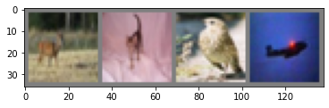
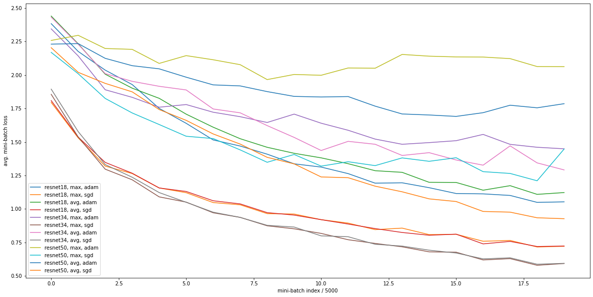
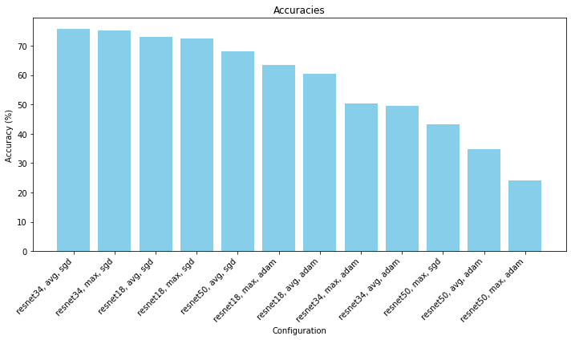
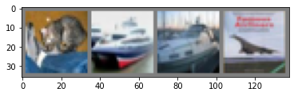

# ResNet Comparison
### Author: WonJae Lee

This project aims to compare different configurations of ResNet on CIFAR-10 dataset for image classification to decide the best performing model for the dataset. We conducted experiments by varying the number of ResNet layers (18, 34, 50), pooling function (avg, max), and the optimizers (SGD, Adam), resulting in the following 12 ResNet configurations:

ResNet-18 + max pooling + SGD

ResNet-18 + max pooling + Adam

ResNet-18 + avg pooling + SGD

ResNet-18 + avg pooling + Adam

ResNet-34 + max pooling + SGD

ResNet-34 + max pooling + Adam

ResNet-34 + avg pooling + SGD

ResNet-34 + avg pooling + Adam

ResNet-50 + max pooling + SGD

ResNet-50 + max pooling + Adam

ResNet-50 + avg pooling + SGD

ResNet-50 + avg pooling + Adam


```python
%matplotlib inline
import matplotlib.pyplot as plt
import numpy as np
import torch
import torchvision
from torchvision import models
from torchvision.models import ResNet18_Weights, ResNet34_Weights, ResNet50_Weights
import torchvision.transforms as transforms
import torch.nn as nn
import torch.nn.functional as F
import torch.optim as optim
```

#### Prepare for Dataset

We will use the CIFAR-10 dataset from torchvision library, and we will normalize the images. The dataset contains 10 different classes: plane, car, bird, cat, deer, dog, frog, horse, ship, and truck.


```python
transform = transforms.Compose(
    [transforms.ToTensor(),
     transforms.Normalize((0.5, 0.5, 0.5), (0.5, 0.5, 0.5))])

trainset = torchvision.datasets.CIFAR10(root='./data', train=True,
                                        download=True, transform=transform)
trainloader = torch.utils.data.DataLoader(trainset, batch_size=4,
                                          shuffle=True, num_workers=2)

testset = torchvision.datasets.CIFAR10(root='./data', train=False,
                                       download=True, transform=transform)
testloader = torch.utils.data.DataLoader(testset, batch_size=4,
                                         shuffle=False, num_workers=2)

classes = ('plane', 'car', 'bird', 'cat',
           'deer', 'dog', 'frog', 'horse', 'ship', 'truck')
```

    Files already downloaded and verified
    Files already downloaded and verified


```python
# The function to show an image.
def imshow(img):
    img = img / 2 + 0.5     # Unnormalize.
    npimg = img.numpy()
    plt.imshow(np.transpose(npimg, (1, 2, 0)))
    plt.show()

# Get some random training images.
dataiter = iter(trainloader)
images, labels = next(dataiter)
# Show images.
imshow(torchvision.utils.make_grid(images))
# Print labels.
print(' '.join('%5s' % classes[labels[j]] for j in range(4)))
```


    

    


     deer   cat  bird plane


```python
# If there are GPUs, choose the first one for computing. Otherwise use CPU.
device = torch.device("cuda:0" if torch.cuda.is_available() else "cpu")
print(device)
# If 'cuda:0' is printed, it means GPU is available.
```

    cuda:0


We define a function that takes in ResNet version and pooling function to initialize models with the specific configurations. Here, we set out_features to 10 because we know there are 10 classes in our dataset.


```python
def get_resnet_model(version='resnet18', pooling_type='max'):
    if version == 'resnet18':
        model = models.resnet18(weights=ResNet18_Weights.DEFAULT)
    elif version == 'resnet34':
        model = models.resnet34(weights=ResNet34_Weights.DEFAULT)
    elif version == 'resnet50':
        model = models.resnet50(weights=ResNet50_Weights.DEFAULT)
    
    if pooling_type == 'avg':
        model.avgpool = nn.AdaptiveAvgPool2d((1, 1))
    elif pooling_type == 'max':
        model.avgpool = nn.AdaptiveMaxPool2d((1, 1))
    
    model.fc = nn.Linear(in_features=model.fc.in_features, out_features=10)
    
    return model
```

Now, we train the 12 total combinations of models and save relevant informations like  version, pooling_type, optimizer, avg_loss, accuracy, class_acc, and model.


```python
versions = ['resnet18', 'resnet34', 'resnet50']
pooling_types = ['max', 'avg']
optimizers = {'adam': optim.Adam, 'sgd': optim.SGD}
loss_func = nn.CrossEntropyLoss()

results = []

for version in versions:
    for pooling_type in pooling_types:
        for opt_name, opt_func in optimizers.items():
            print(f"Experiment: {version}, Pooling: {pooling_type}, Optimizer: {opt_name}")
            model = get_resnet_model(version=version, pooling_type=pooling_type)
            model.to(device)
            criterion = nn.CrossEntropyLoss()
            optimizer = opt_func(model.parameters(), lr=0.001)  # Adjust hyperparameters as needed

            avg_losses = []   # Avg. losses.
            epochs = 10       # Total epochs.
            print_freq = 5000  # Print frequency.

            for epoch in range(epochs):  # Loop over the dataset multiple times.
                running_loss = 0.0       # Initialize running loss.
                for i, data in enumerate(trainloader, 0):
                    # Get the inputs.
                    inputs, labels = data

                    # Move the inputs to the specified device.
                    inputs, labels = inputs.to(device), labels.to(device)

                    # Zero the parameter gradients.
                    optimizer.zero_grad()

                    # Forward step.
                    outputs = model(inputs)
                    loss = loss_func(outputs, labels)

                    # Backward step.
                    loss.backward()

                    # Optimization step (update the parameters).
                    optimizer.step()

                    # Print statistics.
                    running_loss += loss.item()
                    if i % print_freq == print_freq - 1: # Print every several mini-batches.
                        avg_loss = running_loss / print_freq
                        print('[epoch: {}, i: {:5d}] avg mini-batch loss: {:.3f}'.format(epoch, i, avg_loss))
                        avg_losses.append(avg_loss)
                        running_loss = 0.0
                        

            print('Finished Training.')
            
            correct = 0
            total = 0
            with torch.no_grad():
                for data in testloader:
                    images, labels = data
                    images, labels = images.to(device), labels.to(device)
                    outputs = model(images)
                    _, predicted = torch.max(outputs.data, 1)
                    total += labels.size(0)
                    correct += (predicted == labels).sum().item()

            accuracy = 100 * correct / total
            
            # Get test accuracy for each class.
            class_acc = []
            class_correct = list(0. for i in range(10))
            class_total = list(0. for i in range(10))
            with torch.no_grad():
                for data in testloader:
                    images, labels = data
                    images, labels = images.to(device), labels.to(device)
                    outputs = model(images)
                    _, predicted = torch.max(outputs, 1)
                    c = (predicted == labels).squeeze()
                    for i in range(4):
                        label = labels[i]
                        class_correct[label] += c[i].item()
                        class_total[label] += 1

            for i in range(10):
                class_acc.append('Accuracy of %5s : %2d %%' % (
                    classes[i], 100 * class_correct[i] / class_total[i]))
            
            results.append({
                'version': version,
                'pooling_type': pooling_type,
                'optimizer': opt_name,
                'avg_loss': avg_losses,
                'accuracy': accuracy,
                'class_acc': class_acc,
                'model': model
            })
```

    Experiment: resnet18, Pooling: max, Optimizer: adam
    [epoch: 0, i:  4999] avg mini-batch loss: 2.383
    [epoch: 0, i:  9999] avg mini-batch loss: 2.176
    [epoch: 1, i:  4999] avg mini-batch loss: 2.036
    [epoch: 1, i:  9999] avg mini-batch loss: 1.929
    [epoch: 2, i:  4999] avg mini-batch loss: 1.751
    [epoch: 2, i:  9999] avg mini-batch loss: 1.639
    [epoch: 3, i:  4999] avg mini-batch loss: 1.515
    [epoch: 3, i:  9999] avg mini-batch loss: 1.470
    [epoch: 4, i:  4999] avg mini-batch loss: 1.409
    [epoch: 4, i:  9999] avg mini-batch loss: 1.337
    [epoch: 5, i:  4999] avg mini-batch loss: 1.313
    [epoch: 5, i:  9999] avg mini-batch loss: 1.264
    [epoch: 6, i:  4999] avg mini-batch loss: 1.193
    [epoch: 6, i:  9999] avg mini-batch loss: 1.195
    [epoch: 7, i:  4999] avg mini-batch loss: 1.159
    [epoch: 7, i:  9999] avg mini-batch loss: 1.115
    [epoch: 8, i:  4999] avg mini-batch loss: 1.113
    [epoch: 8, i:  9999] avg mini-batch loss: 1.101
    [epoch: 9, i:  4999] avg mini-batch loss: 1.049
    [epoch: 9, i:  9999] avg mini-batch loss: 1.053
    Finished Training.
    Experiment: resnet18, Pooling: max, Optimizer: sgd
    [epoch: 0, i:  4999] avg mini-batch loss: 1.795
    [epoch: 0, i:  9999] avg mini-batch loss: 1.531
    [epoch: 1, i:  4999] avg mini-batch loss: 1.320
    [epoch: 1, i:  9999] avg mini-batch loss: 1.264
    [epoch: 2, i:  4999] avg mini-batch loss: 1.157
    [epoch: 2, i:  9999] avg mini-batch loss: 1.121
    [epoch: 3, i:  4999] avg mini-batch loss: 1.048
    [epoch: 3, i:  9999] avg mini-batch loss: 1.031
    [epoch: 4, i:  4999] avg mini-batch loss: 0.965
    [epoch: 4, i:  9999] avg mini-batch loss: 0.962
    [epoch: 5, i:  4999] avg mini-batch loss: 0.920
    [epoch: 5, i:  9999] avg mini-batch loss: 0.894
    [epoch: 6, i:  4999] avg mini-batch loss: 0.846
    [epoch: 6, i:  9999] avg mini-batch loss: 0.857
    [epoch: 7, i:  4999] avg mini-batch loss: 0.808
    [epoch: 7, i:  9999] avg mini-batch loss: 0.811
    [epoch: 8, i:  4999] avg mini-batch loss: 0.759
    [epoch: 8, i:  9999] avg mini-batch loss: 0.765
    [epoch: 9, i:  4999] avg mini-batch loss: 0.716
    [epoch: 9, i:  9999] avg mini-batch loss: 0.721
    Finished Training.
    Experiment: resnet18, Pooling: avg, Optimizer: adam
    [epoch: 0, i:  4999] avg mini-batch loss: 2.440
    [epoch: 0, i:  9999] avg mini-batch loss: 2.233
    [epoch: 1, i:  4999] avg mini-batch loss: 2.006
    [epoch: 1, i:  9999] avg mini-batch loss: 1.902
    [epoch: 2, i:  4999] avg mini-batch loss: 1.826
    [epoch: 2, i:  9999] avg mini-batch loss: 1.708
    [epoch: 3, i:  4999] avg mini-batch loss: 1.610
    [epoch: 3, i:  9999] avg mini-batch loss: 1.524
    [epoch: 4, i:  4999] avg mini-batch loss: 1.460
    [epoch: 4, i:  9999] avg mini-batch loss: 1.415
    [epoch: 5, i:  4999] avg mini-batch loss: 1.381
    [epoch: 5, i:  9999] avg mini-batch loss: 1.338
    [epoch: 6, i:  4999] avg mini-batch loss: 1.286
    [epoch: 6, i:  9999] avg mini-batch loss: 1.273
    [epoch: 7, i:  4999] avg mini-batch loss: 1.199
    [epoch: 7, i:  9999] avg mini-batch loss: 1.198
    [epoch: 8, i:  4999] avg mini-batch loss: 1.140
    [epoch: 8, i:  9999] avg mini-batch loss: 1.174
    [epoch: 9, i:  4999] avg mini-batch loss: 1.109
    [epoch: 9, i:  9999] avg mini-batch loss: 1.122
    Finished Training.
    Experiment: resnet18, Pooling: avg, Optimizer: sgd
    [epoch: 0, i:  4999] avg mini-batch loss: 1.809
    [epoch: 0, i:  9999] avg mini-batch loss: 1.536
    [epoch: 1, i:  4999] avg mini-batch loss: 1.348
    [epoch: 1, i:  9999] avg mini-batch loss: 1.267
    [epoch: 2, i:  4999] avg mini-batch loss: 1.157
    [epoch: 2, i:  9999] avg mini-batch loss: 1.131
    [epoch: 3, i:  4999] avg mini-batch loss: 1.061
    [epoch: 3, i:  9999] avg mini-batch loss: 1.038
    [epoch: 4, i:  4999] avg mini-batch loss: 0.973
    [epoch: 4, i:  9999] avg mini-batch loss: 0.954
    [epoch: 5, i:  4999] avg mini-batch loss: 0.920
    [epoch: 5, i:  9999] avg mini-batch loss: 0.887
    [epoch: 6, i:  4999] avg mini-batch loss: 0.853
    [epoch: 6, i:  9999] avg mini-batch loss: 0.825
    [epoch: 7, i:  4999] avg mini-batch loss: 0.804
    [epoch: 7, i:  9999] avg mini-batch loss: 0.812
    [epoch: 8, i:  4999] avg mini-batch loss: 0.739
    [epoch: 8, i:  9999] avg mini-batch loss: 0.758
    [epoch: 9, i:  4999] avg mini-batch loss: 0.720
    [epoch: 9, i:  9999] avg mini-batch loss: 0.723
    Finished Training.
    Experiment: resnet34, Pooling: max, Optimizer: adam
    [epoch: 0, i:  4999] avg mini-batch loss: 2.344
    [epoch: 0, i:  9999] avg mini-batch loss: 2.142
    [epoch: 1, i:  4999] avg mini-batch loss: 1.890
    [epoch: 1, i:  9999] avg mini-batch loss: 1.833
    [epoch: 2, i:  4999] avg mini-batch loss: 1.759
    [epoch: 2, i:  9999] avg mini-batch loss: 1.779
    [epoch: 3, i:  4999] avg mini-batch loss: 1.722
    [epoch: 3, i:  9999] avg mini-batch loss: 1.689
    [epoch: 4, i:  4999] avg mini-batch loss: 1.645
    [epoch: 4, i:  9999] avg mini-batch loss: 1.708
    [epoch: 5, i:  4999] avg mini-batch loss: 1.640
    [epoch: 5, i:  9999] avg mini-batch loss: 1.587
    [epoch: 6, i:  4999] avg mini-batch loss: 1.521
    [epoch: 6, i:  9999] avg mini-batch loss: 1.483
    [epoch: 7, i:  4999] avg mini-batch loss: 1.495
    [epoch: 7, i:  9999] avg mini-batch loss: 1.510
    [epoch: 8, i:  4999] avg mini-batch loss: 1.556
    [epoch: 8, i:  9999] avg mini-batch loss: 1.482
    [epoch: 9, i:  4999] avg mini-batch loss: 1.461
    [epoch: 9, i:  9999] avg mini-batch loss: 1.449
    Finished Training.
    Experiment: resnet34, Pooling: max, Optimizer: sgd
    [epoch: 0, i:  4999] avg mini-batch loss: 1.856
    [epoch: 0, i:  9999] avg mini-batch loss: 1.537
    [epoch: 1, i:  4999] avg mini-batch loss: 1.297
    [epoch: 1, i:  9999] avg mini-batch loss: 1.218
    [epoch: 2, i:  4999] avg mini-batch loss: 1.090
    [epoch: 2, i:  9999] avg mini-batch loss: 1.051
    [epoch: 3, i:  4999] avg mini-batch loss: 0.971
    [epoch: 3, i:  9999] avg mini-batch loss: 0.937
    [epoch: 4, i:  4999] avg mini-batch loss: 0.874
    [epoch: 4, i:  9999] avg mini-batch loss: 0.852
    [epoch: 5, i:  4999] avg mini-batch loss: 0.817
    [epoch: 5, i:  9999] avg mini-batch loss: 0.770
    [epoch: 6, i:  4999] avg mini-batch loss: 0.743
    [epoch: 6, i:  9999] avg mini-batch loss: 0.717
    [epoch: 7, i:  4999] avg mini-batch loss: 0.680
    [epoch: 7, i:  9999] avg mini-batch loss: 0.677
    [epoch: 8, i:  4999] avg mini-batch loss: 0.619
    [epoch: 8, i:  9999] avg mini-batch loss: 0.629
    [epoch: 9, i:  4999] avg mini-batch loss: 0.580
    [epoch: 9, i:  9999] avg mini-batch loss: 0.593
    Finished Training.
    Experiment: resnet34, Pooling: avg, Optimizer: adam
    [epoch: 0, i:  4999] avg mini-batch loss: 2.431
    [epoch: 0, i:  9999] avg mini-batch loss: 2.229
    [epoch: 1, i:  4999] avg mini-batch loss: 2.010
    [epoch: 1, i:  9999] avg mini-batch loss: 1.953
    [epoch: 2, i:  4999] avg mini-batch loss: 1.915
    [epoch: 2, i:  9999] avg mini-batch loss: 1.888
    [epoch: 3, i:  4999] avg mini-batch loss: 1.746
    [epoch: 3, i:  9999] avg mini-batch loss: 1.718
    [epoch: 4, i:  4999] avg mini-batch loss: 1.622
    [epoch: 4, i:  9999] avg mini-batch loss: 1.534
    [epoch: 5, i:  4999] avg mini-batch loss: 1.436
    [epoch: 5, i:  9999] avg mini-batch loss: 1.505
    [epoch: 6, i:  4999] avg mini-batch loss: 1.483
    [epoch: 6, i:  9999] avg mini-batch loss: 1.399
    [epoch: 7, i:  4999] avg mini-batch loss: 1.420
    [epoch: 7, i:  9999] avg mini-batch loss: 1.366
    [epoch: 8, i:  4999] avg mini-batch loss: 1.327
    [epoch: 8, i:  9999] avg mini-batch loss: 1.471
    [epoch: 9, i:  4999] avg mini-batch loss: 1.344
    [epoch: 9, i:  9999] avg mini-batch loss: 1.291
    Finished Training.
    Experiment: resnet34, Pooling: avg, Optimizer: sgd
    [epoch: 0, i:  4999] avg mini-batch loss: 1.894
    [epoch: 0, i:  9999] avg mini-batch loss: 1.577
    [epoch: 1, i:  4999] avg mini-batch loss: 1.331
    [epoch: 1, i:  9999] avg mini-batch loss: 1.237
    [epoch: 2, i:  4999] avg mini-batch loss: 1.122
    [epoch: 2, i:  9999] avg mini-batch loss: 1.050
    [epoch: 3, i:  4999] avg mini-batch loss: 0.976
    [epoch: 3, i:  9999] avg mini-batch loss: 0.937
    [epoch: 4, i:  4999] avg mini-batch loss: 0.878
    [epoch: 4, i:  9999] avg mini-batch loss: 0.865
    [epoch: 5, i:  4999] avg mini-batch loss: 0.799
    [epoch: 5, i:  9999] avg mini-batch loss: 0.793
    [epoch: 6, i:  4999] avg mini-batch loss: 0.736
    [epoch: 6, i:  9999] avg mini-batch loss: 0.723
    [epoch: 7, i:  4999] avg mini-batch loss: 0.692
    [epoch: 7, i:  9999] avg mini-batch loss: 0.671
    [epoch: 8, i:  4999] avg mini-batch loss: 0.628
    [epoch: 8, i:  9999] avg mini-batch loss: 0.635
    [epoch: 9, i:  4999] avg mini-batch loss: 0.588
    [epoch: 9, i:  9999] avg mini-batch loss: 0.594
    Finished Training.
    Experiment: resnet50, Pooling: max, Optimizer: adam
    [epoch: 0, i:  4999] avg mini-batch loss: 2.258
    [epoch: 0, i:  9999] avg mini-batch loss: 2.296
    [epoch: 1, i:  4999] avg mini-batch loss: 2.198
    [epoch: 1, i:  9999] avg mini-batch loss: 2.191
    [epoch: 2, i:  4999] avg mini-batch loss: 2.086
    [epoch: 2, i:  9999] avg mini-batch loss: 2.144
    [epoch: 3, i:  4999] avg mini-batch loss: 2.114
    [epoch: 3, i:  9999] avg mini-batch loss: 2.077
    [epoch: 4, i:  4999] avg mini-batch loss: 1.966
    [epoch: 4, i:  9999] avg mini-batch loss: 2.004
    [epoch: 5, i:  4999] avg mini-batch loss: 1.998
    [epoch: 5, i:  9999] avg mini-batch loss: 2.052
    [epoch: 6, i:  4999] avg mini-batch loss: 2.050
    [epoch: 6, i:  9999] avg mini-batch loss: 2.153
    [epoch: 7, i:  4999] avg mini-batch loss: 2.140
    [epoch: 7, i:  9999] avg mini-batch loss: 2.135
    [epoch: 8, i:  4999] avg mini-batch loss: 2.134
    [epoch: 8, i:  9999] avg mini-batch loss: 2.122
    [epoch: 9, i:  4999] avg mini-batch loss: 2.063
    [epoch: 9, i:  9999] avg mini-batch loss: 2.062
    Finished Training.
    Experiment: resnet50, Pooling: max, Optimizer: sgd
    [epoch: 0, i:  4999] avg mini-batch loss: 2.168
    [epoch: 0, i:  9999] avg mini-batch loss: 2.009
    [epoch: 1, i:  4999] avg mini-batch loss: 1.825
    [epoch: 1, i:  9999] avg mini-batch loss: 1.717
    [epoch: 2, i:  4999] avg mini-batch loss: 1.630
    [epoch: 2, i:  9999] avg mini-batch loss: 1.543
    [epoch: 3, i:  4999] avg mini-batch loss: 1.525
    [epoch: 3, i:  9999] avg mini-batch loss: 1.441
    [epoch: 4, i:  4999] avg mini-batch loss: 1.348
    [epoch: 4, i:  9999] avg mini-batch loss: 1.407
    [epoch: 5, i:  4999] avg mini-batch loss: 1.320
    [epoch: 5, i:  9999] avg mini-batch loss: 1.352
    [epoch: 6, i:  4999] avg mini-batch loss: 1.323
    [epoch: 6, i:  9999] avg mini-batch loss: 1.381
    [epoch: 7, i:  4999] avg mini-batch loss: 1.356
    [epoch: 7, i:  9999] avg mini-batch loss: 1.382
    [epoch: 8, i:  4999] avg mini-batch loss: 1.278
    [epoch: 8, i:  9999] avg mini-batch loss: 1.265
    [epoch: 9, i:  4999] avg mini-batch loss: 1.210
    [epoch: 9, i:  9999] avg mini-batch loss: 1.447
    Finished Training.
    Experiment: resnet50, Pooling: avg, Optimizer: adam
    [epoch: 0, i:  4999] avg mini-batch loss: 2.230
    [epoch: 0, i:  9999] avg mini-batch loss: 2.234
    [epoch: 1, i:  4999] avg mini-batch loss: 2.124
    [epoch: 1, i:  9999] avg mini-batch loss: 2.069
    [epoch: 2, i:  4999] avg mini-batch loss: 2.046
    [epoch: 2, i:  9999] avg mini-batch loss: 1.983
    [epoch: 3, i:  4999] avg mini-batch loss: 1.926
    [epoch: 3, i:  9999] avg mini-batch loss: 1.918
    [epoch: 4, i:  4999] avg mini-batch loss: 1.876
    [epoch: 4, i:  9999] avg mini-batch loss: 1.840
    [epoch: 5, i:  4999] avg mini-batch loss: 1.836
    [epoch: 5, i:  9999] avg mini-batch loss: 1.839
    [epoch: 6, i:  4999] avg mini-batch loss: 1.767
    [epoch: 6, i:  9999] avg mini-batch loss: 1.709
    [epoch: 7, i:  4999] avg mini-batch loss: 1.701
    [epoch: 7, i:  9999] avg mini-batch loss: 1.691
    [epoch: 8, i:  4999] avg mini-batch loss: 1.719
    [epoch: 8, i:  9999] avg mini-batch loss: 1.774
    [epoch: 9, i:  4999] avg mini-batch loss: 1.755
    [epoch: 9, i:  9999] avg mini-batch loss: 1.786
    Finished Training.
    Experiment: resnet50, Pooling: avg, Optimizer: sgd
    [epoch: 0, i:  4999] avg mini-batch loss: 2.203
    [epoch: 0, i:  9999] avg mini-batch loss: 2.020
    [epoch: 1, i:  4999] avg mini-batch loss: 1.937
    [epoch: 1, i:  9999] avg mini-batch loss: 1.874
    [epoch: 2, i:  4999] avg mini-batch loss: 1.742
    [epoch: 2, i:  9999] avg mini-batch loss: 1.661
    [epoch: 3, i:  4999] avg mini-batch loss: 1.560
    [epoch: 3, i:  9999] avg mini-batch loss: 1.484
    [epoch: 4, i:  4999] avg mini-batch loss: 1.385
    [epoch: 4, i:  9999] avg mini-batch loss: 1.336
    [epoch: 5, i:  4999] avg mini-batch loss: 1.239
    [epoch: 5, i:  9999] avg mini-batch loss: 1.233
    [epoch: 6, i:  4999] avg mini-batch loss: 1.170
    [epoch: 6, i:  9999] avg mini-batch loss: 1.128
    [epoch: 7, i:  4999] avg mini-batch loss: 1.075
    [epoch: 7, i:  9999] avg mini-batch loss: 1.055
    [epoch: 8, i:  4999] avg mini-batch loss: 0.981
    [epoch: 8, i:  9999] avg mini-batch loss: 0.976
    [epoch: 9, i:  4999] avg mini-batch loss: 0.934
    [epoch: 9, i:  9999] avg mini-batch loss: 0.927
    Finished Training.


Because the training takes a long time, we save the trained models using pickle.


```python
import pickle

# with open('results.pkl', 'wb') as f:
#     pickle.dump(results, f)
```


```python
with open('results.pkl', 'rb') as f:
    pkl = pickle.load(f)

```


```python
pkl
```


    [{'version': 'resnet18',
      'pooling_type': 'max',
      'optimizer': 'adam',
      'avg_loss': [2.3830058534026146,
       2.175640135931969,
       2.036349908876419,
       1.9285238191008567,
       1.750716401553154,
       1.639212390244007,
       1.5152053354740143,
       1.4697045574307441,
       1.4089140662670137,
       1.3368305223912,
       1.3126504167199136,
       1.2637714732825756,
       1.1925504169270396,
       1.1952512601554395,
       1.1587313720181585,
       1.1152591843947768,
       1.1125949611946941,
       1.1008809475980699,
       1.049187705259025,
       1.0530445254705847],
      'accuracy': 63.56,
      'class_acc': ['Accuracy of plane : 67 %',
       'Accuracy of   car : 76 %',
       'Accuracy of  bird : 47 %',
       'Accuracy of   cat : 28 %',
       'Accuracy of  deer : 56 %',
       'Accuracy of   dog : 62 %',
       'Accuracy of  frog : 74 %',
       'Accuracy of horse : 75 %',
       'Accuracy of  ship : 76 %',
       'Accuracy of truck : 71 %'],
      'model': ResNet(
        (conv1): Conv2d(3, 64, kernel_size=(7, 7), stride=(2, 2), padding=(3, 3), bias=False)
        (bn1): BatchNorm2d(64, eps=1e-05, momentum=0.1, affine=True, track_running_stats=True)
        (relu): ReLU(inplace=True)
        (maxpool): MaxPool2d(kernel_size=3, stride=2, padding=1, dilation=1, ceil_mode=False)
        (layer1): Sequential(
          (0): BasicBlock(
            (conv1): Conv2d(64, 64, kernel_size=(3, 3), stride=(1, 1), padding=(1, 1), bias=False)
            (bn1): BatchNorm2d(64, eps=1e-05, momentum=0.1, affine=True, track_running_stats=True)
            (relu): ReLU(inplace=True)
            (conv2): Conv2d(64, 64, kernel_size=(3, 3), stride=(1, 1), padding=(1, 1), bias=False)
            (bn2): BatchNorm2d(64, eps=1e-05, momentum=0.1, affine=True, track_running_stats=True)
          )
          (1): BasicBlock(
            (conv1): Conv2d(64, 64, kernel_size=(3, 3), stride=(1, 1), padding=(1, 1), bias=False)
            (bn1): BatchNorm2d(64, eps=1e-05, momentum=0.1, affine=True, track_running_stats=True)
            (relu): ReLU(inplace=True)
            (conv2): Conv2d(64, 64, kernel_size=(3, 3), stride=(1, 1), padding=(1, 1), bias=False)
            (bn2): BatchNorm2d(64, eps=1e-05, momentum=0.1, affine=True, track_running_stats=True)
          )
        )
        (layer2): Sequential(
          (0): BasicBlock(
            (conv1): Conv2d(64, 128, kernel_size=(3, 3), stride=(2, 2), padding=(1, 1), bias=False)
            (bn1): BatchNorm2d(128, eps=1e-05, momentum=0.1, affine=True, track_running_stats=True)
            (relu): ReLU(inplace=True)
            (conv2): Conv2d(128, 128, kernel_size=(3, 3), stride=(1, 1), padding=(1, 1), bias=False)
            (bn2): BatchNorm2d(128, eps=1e-05, momentum=0.1, affine=True, track_running_stats=True)
            (downsample): Sequential(
              (0): Conv2d(64, 128, kernel_size=(1, 1), stride=(2, 2), bias=False)
              (1): BatchNorm2d(128, eps=1e-05, momentum=0.1, affine=True, track_running_stats=True)
            )
          )
          (1): BasicBlock(
            (conv1): Conv2d(128, 128, kernel_size=(3, 3), stride=(1, 1), padding=(1, 1), bias=False)
            (bn1): BatchNorm2d(128, eps=1e-05, momentum=0.1, affine=True, track_running_stats=True)
            (relu): ReLU(inplace=True)
            (conv2): Conv2d(128, 128, kernel_size=(3, 3), stride=(1, 1), padding=(1, 1), bias=False)
            (bn2): BatchNorm2d(128, eps=1e-05, momentum=0.1, affine=True, track_running_stats=True)
          )
        )
        (layer3): Sequential(
          (0): BasicBlock(
            (conv1): Conv2d(128, 256, kernel_size=(3, 3), stride=(2, 2), padding=(1, 1), bias=False)
            (bn1): BatchNorm2d(256, eps=1e-05, momentum=0.1, affine=True, track_running_stats=True)
            (relu): ReLU(inplace=True)
            (conv2): Conv2d(256, 256, kernel_size=(3, 3), stride=(1, 1), padding=(1, 1), bias=False)
            (bn2): BatchNorm2d(256, eps=1e-05, momentum=0.1, affine=True, track_running_stats=True)
            (downsample): Sequential(
              (0): Conv2d(128, 256, kernel_size=(1, 1), stride=(2, 2), bias=False)
              (1): BatchNorm2d(256, eps=1e-05, momentum=0.1, affine=True, track_running_stats=True)
            )
          )
          (1): BasicBlock(
            (conv1): Conv2d(256, 256, kernel_size=(3, 3), stride=(1, 1), padding=(1, 1), bias=False)
            (bn1): BatchNorm2d(256, eps=1e-05, momentum=0.1, affine=True, track_running_stats=True)
            (relu): ReLU(inplace=True)
            (conv2): Conv2d(256, 256, kernel_size=(3, 3), stride=(1, 1), padding=(1, 1), bias=False)
            (bn2): BatchNorm2d(256, eps=1e-05, momentum=0.1, affine=True, track_running_stats=True)
          )
        )
        (layer4): Sequential(
          (0): BasicBlock(
            (conv1): Conv2d(256, 512, kernel_size=(3, 3), stride=(2, 2), padding=(1, 1), bias=False)
            (bn1): BatchNorm2d(512, eps=1e-05, momentum=0.1, affine=True, track_running_stats=True)
            (relu): ReLU(inplace=True)
            (conv2): Conv2d(512, 512, kernel_size=(3, 3), stride=(1, 1), padding=(1, 1), bias=False)
            (bn2): BatchNorm2d(512, eps=1e-05, momentum=0.1, affine=True, track_running_stats=True)
            (downsample): Sequential(
              (0): Conv2d(256, 512, kernel_size=(1, 1), stride=(2, 2), bias=False)
              (1): BatchNorm2d(512, eps=1e-05, momentum=0.1, affine=True, track_running_stats=True)
            )
          )
          (1): BasicBlock(
            (conv1): Conv2d(512, 512, kernel_size=(3, 3), stride=(1, 1), padding=(1, 1), bias=False)
            (bn1): BatchNorm2d(512, eps=1e-05, momentum=0.1, affine=True, track_running_stats=True)
            (relu): ReLU(inplace=True)
            (conv2): Conv2d(512, 512, kernel_size=(3, 3), stride=(1, 1), padding=(1, 1), bias=False)
            (bn2): BatchNorm2d(512, eps=1e-05, momentum=0.1, affine=True, track_running_stats=True)
          )
        )
        (avgpool): AdaptiveMaxPool2d(output_size=(1, 1))
        (fc): Linear(in_features=512, out_features=10, bias=True)
      )},
     {'version': 'resnet18',
      'pooling_type': 'max',
      'optimizer': 'sgd',
      'avg_loss': [1.7952711385428906,
       1.5305467502832413,
       1.320032430204749,
       1.2643768066585064,
       1.156806570404768,
       1.121398381574452,
       1.0477869961172341,
       1.031075802242756,
       0.9651448530867696,
       0.9619360381640494,
       0.9201769231937825,
       0.8943743432600051,
       0.8455325797110796,
       0.8570022035680711,
       0.8084057775735856,
       0.8111127950005234,
       0.7589071271963418,
       0.7649174158090726,
       0.7162338493917138,
       0.7212443254331127],
      'accuracy': 72.52,
      'class_acc': ['Accuracy of plane : 75 %',
       'Accuracy of   car : 89 %',
       'Accuracy of  bird : 60 %',
       'Accuracy of   cat : 50 %',
       'Accuracy of  deer : 73 %',
       'Accuracy of   dog : 65 %',
       'Accuracy of  frog : 74 %',
       'Accuracy of horse : 76 %',
       'Accuracy of  ship : 79 %',
       'Accuracy of truck : 80 %'],
      'model': ResNet(
        (conv1): Conv2d(3, 64, kernel_size=(7, 7), stride=(2, 2), padding=(3, 3), bias=False)
        (bn1): BatchNorm2d(64, eps=1e-05, momentum=0.1, affine=True, track_running_stats=True)
        (relu): ReLU(inplace=True)
        (maxpool): MaxPool2d(kernel_size=3, stride=2, padding=1, dilation=1, ceil_mode=False)
        (layer1): Sequential(
          (0): BasicBlock(
            (conv1): Conv2d(64, 64, kernel_size=(3, 3), stride=(1, 1), padding=(1, 1), bias=False)
            (bn1): BatchNorm2d(64, eps=1e-05, momentum=0.1, affine=True, track_running_stats=True)
            (relu): ReLU(inplace=True)
            (conv2): Conv2d(64, 64, kernel_size=(3, 3), stride=(1, 1), padding=(1, 1), bias=False)
            (bn2): BatchNorm2d(64, eps=1e-05, momentum=0.1, affine=True, track_running_stats=True)
          )
          (1): BasicBlock(
            (conv1): Conv2d(64, 64, kernel_size=(3, 3), stride=(1, 1), padding=(1, 1), bias=False)
            (bn1): BatchNorm2d(64, eps=1e-05, momentum=0.1, affine=True, track_running_stats=True)
            (relu): ReLU(inplace=True)
            (conv2): Conv2d(64, 64, kernel_size=(3, 3), stride=(1, 1), padding=(1, 1), bias=False)
            (bn2): BatchNorm2d(64, eps=1e-05, momentum=0.1, affine=True, track_running_stats=True)
          )
        )
        (layer2): Sequential(
          (0): BasicBlock(
            (conv1): Conv2d(64, 128, kernel_size=(3, 3), stride=(2, 2), padding=(1, 1), bias=False)
            (bn1): BatchNorm2d(128, eps=1e-05, momentum=0.1, affine=True, track_running_stats=True)
            (relu): ReLU(inplace=True)
            (conv2): Conv2d(128, 128, kernel_size=(3, 3), stride=(1, 1), padding=(1, 1), bias=False)
            (bn2): BatchNorm2d(128, eps=1e-05, momentum=0.1, affine=True, track_running_stats=True)
            (downsample): Sequential(
              (0): Conv2d(64, 128, kernel_size=(1, 1), stride=(2, 2), bias=False)
              (1): BatchNorm2d(128, eps=1e-05, momentum=0.1, affine=True, track_running_stats=True)
            )
          )
          (1): BasicBlock(
            (conv1): Conv2d(128, 128, kernel_size=(3, 3), stride=(1, 1), padding=(1, 1), bias=False)
            (bn1): BatchNorm2d(128, eps=1e-05, momentum=0.1, affine=True, track_running_stats=True)
            (relu): ReLU(inplace=True)
            (conv2): Conv2d(128, 128, kernel_size=(3, 3), stride=(1, 1), padding=(1, 1), bias=False)
            (bn2): BatchNorm2d(128, eps=1e-05, momentum=0.1, affine=True, track_running_stats=True)
          )
        )
        (layer3): Sequential(
          (0): BasicBlock(
            (conv1): Conv2d(128, 256, kernel_size=(3, 3), stride=(2, 2), padding=(1, 1), bias=False)
            (bn1): BatchNorm2d(256, eps=1e-05, momentum=0.1, affine=True, track_running_stats=True)
            (relu): ReLU(inplace=True)
            (conv2): Conv2d(256, 256, kernel_size=(3, 3), stride=(1, 1), padding=(1, 1), bias=False)
            (bn2): BatchNorm2d(256, eps=1e-05, momentum=0.1, affine=True, track_running_stats=True)
            (downsample): Sequential(
              (0): Conv2d(128, 256, kernel_size=(1, 1), stride=(2, 2), bias=False)
              (1): BatchNorm2d(256, eps=1e-05, momentum=0.1, affine=True, track_running_stats=True)
            )
          )
          (1): BasicBlock(
            (conv1): Conv2d(256, 256, kernel_size=(3, 3), stride=(1, 1), padding=(1, 1), bias=False)
            (bn1): BatchNorm2d(256, eps=1e-05, momentum=0.1, affine=True, track_running_stats=True)
            (relu): ReLU(inplace=True)
            (conv2): Conv2d(256, 256, kernel_size=(3, 3), stride=(1, 1), padding=(1, 1), bias=False)
            (bn2): BatchNorm2d(256, eps=1e-05, momentum=0.1, affine=True, track_running_stats=True)
          )
        )
        (layer4): Sequential(
          (0): BasicBlock(
            (conv1): Conv2d(256, 512, kernel_size=(3, 3), stride=(2, 2), padding=(1, 1), bias=False)
            (bn1): BatchNorm2d(512, eps=1e-05, momentum=0.1, affine=True, track_running_stats=True)
            (relu): ReLU(inplace=True)
            (conv2): Conv2d(512, 512, kernel_size=(3, 3), stride=(1, 1), padding=(1, 1), bias=False)
            (bn2): BatchNorm2d(512, eps=1e-05, momentum=0.1, affine=True, track_running_stats=True)
            (downsample): Sequential(
              (0): Conv2d(256, 512, kernel_size=(1, 1), stride=(2, 2), bias=False)
              (1): BatchNorm2d(512, eps=1e-05, momentum=0.1, affine=True, track_running_stats=True)
            )
          )
          (1): BasicBlock(
            (conv1): Conv2d(512, 512, kernel_size=(3, 3), stride=(1, 1), padding=(1, 1), bias=False)
            (bn1): BatchNorm2d(512, eps=1e-05, momentum=0.1, affine=True, track_running_stats=True)
            (relu): ReLU(inplace=True)
            (conv2): Conv2d(512, 512, kernel_size=(3, 3), stride=(1, 1), padding=(1, 1), bias=False)
            (bn2): BatchNorm2d(512, eps=1e-05, momentum=0.1, affine=True, track_running_stats=True)
          )
        )
        (avgpool): AdaptiveMaxPool2d(output_size=(1, 1))
        (fc): Linear(in_features=512, out_features=10, bias=True)
      )},
     {'version': 'resnet18',
      'pooling_type': 'avg',
      'optimizer': 'adam',
      'avg_loss': [2.439594176340103,
       2.2327360375642775,
       2.0059529295682905,
       1.9015525900363923,
       1.825770267522335,
       1.7076307306885719,
       1.6103214785456657,
       1.5243504873096942,
       1.4602830113530159,
       1.4154428065538407,
       1.381401672258973,
       1.3377797169089318,
       1.285545687443018,
       1.273377474936843,
       1.1989278951048852,
       1.1978432545155286,
       1.1399740839391947,
       1.1737986033186316,
       1.108944697893411,
       1.1223324744090437],
      'accuracy': 60.38,
      'class_acc': ['Accuracy of plane : 71 %',
       'Accuracy of   car : 77 %',
       'Accuracy of  bird : 33 %',
       'Accuracy of   cat : 42 %',
       'Accuracy of  deer : 51 %',
       'Accuracy of   dog : 43 %',
       'Accuracy of  frog : 67 %',
       'Accuracy of horse : 68 %',
       'Accuracy of  ship : 76 %',
       'Accuracy of truck : 71 %'],
      'model': ResNet(
        (conv1): Conv2d(3, 64, kernel_size=(7, 7), stride=(2, 2), padding=(3, 3), bias=False)
        (bn1): BatchNorm2d(64, eps=1e-05, momentum=0.1, affine=True, track_running_stats=True)
        (relu): ReLU(inplace=True)
        (maxpool): MaxPool2d(kernel_size=3, stride=2, padding=1, dilation=1, ceil_mode=False)
        (layer1): Sequential(
          (0): BasicBlock(
            (conv1): Conv2d(64, 64, kernel_size=(3, 3), stride=(1, 1), padding=(1, 1), bias=False)
            (bn1): BatchNorm2d(64, eps=1e-05, momentum=0.1, affine=True, track_running_stats=True)
            (relu): ReLU(inplace=True)
            (conv2): Conv2d(64, 64, kernel_size=(3, 3), stride=(1, 1), padding=(1, 1), bias=False)
            (bn2): BatchNorm2d(64, eps=1e-05, momentum=0.1, affine=True, track_running_stats=True)
          )
          (1): BasicBlock(
            (conv1): Conv2d(64, 64, kernel_size=(3, 3), stride=(1, 1), padding=(1, 1), bias=False)
            (bn1): BatchNorm2d(64, eps=1e-05, momentum=0.1, affine=True, track_running_stats=True)
            (relu): ReLU(inplace=True)
            (conv2): Conv2d(64, 64, kernel_size=(3, 3), stride=(1, 1), padding=(1, 1), bias=False)
            (bn2): BatchNorm2d(64, eps=1e-05, momentum=0.1, affine=True, track_running_stats=True)
          )
        )
        (layer2): Sequential(
          (0): BasicBlock(
            (conv1): Conv2d(64, 128, kernel_size=(3, 3), stride=(2, 2), padding=(1, 1), bias=False)
            (bn1): BatchNorm2d(128, eps=1e-05, momentum=0.1, affine=True, track_running_stats=True)
            (relu): ReLU(inplace=True)
            (conv2): Conv2d(128, 128, kernel_size=(3, 3), stride=(1, 1), padding=(1, 1), bias=False)
            (bn2): BatchNorm2d(128, eps=1e-05, momentum=0.1, affine=True, track_running_stats=True)
            (downsample): Sequential(
              (0): Conv2d(64, 128, kernel_size=(1, 1), stride=(2, 2), bias=False)
              (1): BatchNorm2d(128, eps=1e-05, momentum=0.1, affine=True, track_running_stats=True)
            )
          )
          (1): BasicBlock(
            (conv1): Conv2d(128, 128, kernel_size=(3, 3), stride=(1, 1), padding=(1, 1), bias=False)
            (bn1): BatchNorm2d(128, eps=1e-05, momentum=0.1, affine=True, track_running_stats=True)
            (relu): ReLU(inplace=True)
            (conv2): Conv2d(128, 128, kernel_size=(3, 3), stride=(1, 1), padding=(1, 1), bias=False)
            (bn2): BatchNorm2d(128, eps=1e-05, momentum=0.1, affine=True, track_running_stats=True)
          )
        )
        (layer3): Sequential(
          (0): BasicBlock(
            (conv1): Conv2d(128, 256, kernel_size=(3, 3), stride=(2, 2), padding=(1, 1), bias=False)
            (bn1): BatchNorm2d(256, eps=1e-05, momentum=0.1, affine=True, track_running_stats=True)
            (relu): ReLU(inplace=True)
            (conv2): Conv2d(256, 256, kernel_size=(3, 3), stride=(1, 1), padding=(1, 1), bias=False)
            (bn2): BatchNorm2d(256, eps=1e-05, momentum=0.1, affine=True, track_running_stats=True)
            (downsample): Sequential(
              (0): Conv2d(128, 256, kernel_size=(1, 1), stride=(2, 2), bias=False)
              (1): BatchNorm2d(256, eps=1e-05, momentum=0.1, affine=True, track_running_stats=True)
            )
          )
          (1): BasicBlock(
            (conv1): Conv2d(256, 256, kernel_size=(3, 3), stride=(1, 1), padding=(1, 1), bias=False)
            (bn1): BatchNorm2d(256, eps=1e-05, momentum=0.1, affine=True, track_running_stats=True)
            (relu): ReLU(inplace=True)
            (conv2): Conv2d(256, 256, kernel_size=(3, 3), stride=(1, 1), padding=(1, 1), bias=False)
            (bn2): BatchNorm2d(256, eps=1e-05, momentum=0.1, affine=True, track_running_stats=True)
          )
        )
        (layer4): Sequential(
          (0): BasicBlock(
            (conv1): Conv2d(256, 512, kernel_size=(3, 3), stride=(2, 2), padding=(1, 1), bias=False)
            (bn1): BatchNorm2d(512, eps=1e-05, momentum=0.1, affine=True, track_running_stats=True)
            (relu): ReLU(inplace=True)
            (conv2): Conv2d(512, 512, kernel_size=(3, 3), stride=(1, 1), padding=(1, 1), bias=False)
            (bn2): BatchNorm2d(512, eps=1e-05, momentum=0.1, affine=True, track_running_stats=True)
            (downsample): Sequential(
              (0): Conv2d(256, 512, kernel_size=(1, 1), stride=(2, 2), bias=False)
              (1): BatchNorm2d(512, eps=1e-05, momentum=0.1, affine=True, track_running_stats=True)
            )
          )
          (1): BasicBlock(
            (conv1): Conv2d(512, 512, kernel_size=(3, 3), stride=(1, 1), padding=(1, 1), bias=False)
            (bn1): BatchNorm2d(512, eps=1e-05, momentum=0.1, affine=True, track_running_stats=True)
            (relu): ReLU(inplace=True)
            (conv2): Conv2d(512, 512, kernel_size=(3, 3), stride=(1, 1), padding=(1, 1), bias=False)
            (bn2): BatchNorm2d(512, eps=1e-05, momentum=0.1, affine=True, track_running_stats=True)
          )
        )
        (avgpool): AdaptiveAvgPool2d(output_size=(1, 1))
        (fc): Linear(in_features=512, out_features=10, bias=True)
      )},
     {'version': 'resnet18',
      'pooling_type': 'avg',
      'optimizer': 'sgd',
      'avg_loss': [1.8087803582012654,
       1.536048199391365,
       1.3475936106711626,
       1.2667518108651041,
       1.1566555893689394,
       1.130526902912557,
       1.0611498470932246,
       1.0378306867316365,
       0.972610978102684,
       0.9541674360580742,
       0.9200284111440181,
       0.8873753141187132,
       0.8534745519608259,
       0.8245070268698037,
       0.8037398355334997,
       0.8117671784315258,
       0.7392792403604835,
       0.7577835337691009,
       0.7197353470467031,
       0.7232079291451723],
      'accuracy': 73.09,
      'class_acc': ['Accuracy of plane : 82 %',
       'Accuracy of   car : 86 %',
       'Accuracy of  bird : 67 %',
       'Accuracy of   cat : 52 %',
       'Accuracy of  deer : 61 %',
       'Accuracy of   dog : 61 %',
       'Accuracy of  frog : 80 %',
       'Accuracy of horse : 75 %',
       'Accuracy of  ship : 80 %',
       'Accuracy of truck : 81 %'],
      'model': ResNet(
        (conv1): Conv2d(3, 64, kernel_size=(7, 7), stride=(2, 2), padding=(3, 3), bias=False)
        (bn1): BatchNorm2d(64, eps=1e-05, momentum=0.1, affine=True, track_running_stats=True)
        (relu): ReLU(inplace=True)
        (maxpool): MaxPool2d(kernel_size=3, stride=2, padding=1, dilation=1, ceil_mode=False)
        (layer1): Sequential(
          (0): BasicBlock(
            (conv1): Conv2d(64, 64, kernel_size=(3, 3), stride=(1, 1), padding=(1, 1), bias=False)
            (bn1): BatchNorm2d(64, eps=1e-05, momentum=0.1, affine=True, track_running_stats=True)
            (relu): ReLU(inplace=True)
            (conv2): Conv2d(64, 64, kernel_size=(3, 3), stride=(1, 1), padding=(1, 1), bias=False)
            (bn2): BatchNorm2d(64, eps=1e-05, momentum=0.1, affine=True, track_running_stats=True)
          )
          (1): BasicBlock(
            (conv1): Conv2d(64, 64, kernel_size=(3, 3), stride=(1, 1), padding=(1, 1), bias=False)
            (bn1): BatchNorm2d(64, eps=1e-05, momentum=0.1, affine=True, track_running_stats=True)
            (relu): ReLU(inplace=True)
            (conv2): Conv2d(64, 64, kernel_size=(3, 3), stride=(1, 1), padding=(1, 1), bias=False)
            (bn2): BatchNorm2d(64, eps=1e-05, momentum=0.1, affine=True, track_running_stats=True)
          )
        )
        (layer2): Sequential(
          (0): BasicBlock(
            (conv1): Conv2d(64, 128, kernel_size=(3, 3), stride=(2, 2), padding=(1, 1), bias=False)
            (bn1): BatchNorm2d(128, eps=1e-05, momentum=0.1, affine=True, track_running_stats=True)
            (relu): ReLU(inplace=True)
            (conv2): Conv2d(128, 128, kernel_size=(3, 3), stride=(1, 1), padding=(1, 1), bias=False)
            (bn2): BatchNorm2d(128, eps=1e-05, momentum=0.1, affine=True, track_running_stats=True)
            (downsample): Sequential(
              (0): Conv2d(64, 128, kernel_size=(1, 1), stride=(2, 2), bias=False)
              (1): BatchNorm2d(128, eps=1e-05, momentum=0.1, affine=True, track_running_stats=True)
            )
          )
          (1): BasicBlock(
            (conv1): Conv2d(128, 128, kernel_size=(3, 3), stride=(1, 1), padding=(1, 1), bias=False)
            (bn1): BatchNorm2d(128, eps=1e-05, momentum=0.1, affine=True, track_running_stats=True)
            (relu): ReLU(inplace=True)
            (conv2): Conv2d(128, 128, kernel_size=(3, 3), stride=(1, 1), padding=(1, 1), bias=False)
            (bn2): BatchNorm2d(128, eps=1e-05, momentum=0.1, affine=True, track_running_stats=True)
          )
        )
        (layer3): Sequential(
          (0): BasicBlock(
            (conv1): Conv2d(128, 256, kernel_size=(3, 3), stride=(2, 2), padding=(1, 1), bias=False)
            (bn1): BatchNorm2d(256, eps=1e-05, momentum=0.1, affine=True, track_running_stats=True)
            (relu): ReLU(inplace=True)
            (conv2): Conv2d(256, 256, kernel_size=(3, 3), stride=(1, 1), padding=(1, 1), bias=False)
            (bn2): BatchNorm2d(256, eps=1e-05, momentum=0.1, affine=True, track_running_stats=True)
            (downsample): Sequential(
              (0): Conv2d(128, 256, kernel_size=(1, 1), stride=(2, 2), bias=False)
              (1): BatchNorm2d(256, eps=1e-05, momentum=0.1, affine=True, track_running_stats=True)
            )
          )
          (1): BasicBlock(
            (conv1): Conv2d(256, 256, kernel_size=(3, 3), stride=(1, 1), padding=(1, 1), bias=False)
            (bn1): BatchNorm2d(256, eps=1e-05, momentum=0.1, affine=True, track_running_stats=True)
            (relu): ReLU(inplace=True)
            (conv2): Conv2d(256, 256, kernel_size=(3, 3), stride=(1, 1), padding=(1, 1), bias=False)
            (bn2): BatchNorm2d(256, eps=1e-05, momentum=0.1, affine=True, track_running_stats=True)
          )
        )
        (layer4): Sequential(
          (0): BasicBlock(
            (conv1): Conv2d(256, 512, kernel_size=(3, 3), stride=(2, 2), padding=(1, 1), bias=False)
            (bn1): BatchNorm2d(512, eps=1e-05, momentum=0.1, affine=True, track_running_stats=True)
            (relu): ReLU(inplace=True)
            (conv2): Conv2d(512, 512, kernel_size=(3, 3), stride=(1, 1), padding=(1, 1), bias=False)
            (bn2): BatchNorm2d(512, eps=1e-05, momentum=0.1, affine=True, track_running_stats=True)
            (downsample): Sequential(
              (0): Conv2d(256, 512, kernel_size=(1, 1), stride=(2, 2), bias=False)
              (1): BatchNorm2d(512, eps=1e-05, momentum=0.1, affine=True, track_running_stats=True)
            )
          )
          (1): BasicBlock(
            (conv1): Conv2d(512, 512, kernel_size=(3, 3), stride=(1, 1), padding=(1, 1), bias=False)
            (bn1): BatchNorm2d(512, eps=1e-05, momentum=0.1, affine=True, track_running_stats=True)
            (relu): ReLU(inplace=True)
            (conv2): Conv2d(512, 512, kernel_size=(3, 3), stride=(1, 1), padding=(1, 1), bias=False)
            (bn2): BatchNorm2d(512, eps=1e-05, momentum=0.1, affine=True, track_running_stats=True)
          )
        )
        (avgpool): AdaptiveAvgPool2d(output_size=(1, 1))
        (fc): Linear(in_features=512, out_features=10, bias=True)
      )},
     {'version': 'resnet34',
      'pooling_type': 'max',
      'optimizer': 'adam',
      'avg_loss': [2.3440965349674223,
       2.1421834191322326,
       1.8897365681886673,
       1.8331747086524963,
       1.7594122374415397,
       1.7792982917070388,
       1.7220231786608695,
       1.6886719231188296,
       1.645480057424307,
       1.7079557242512704,
       1.6400688763082027,
       1.5873510286927224,
       1.521493799060583,
       1.4827797830760479,
       1.4952368782758714,
       1.5095344182372092,
       1.5564352295935153,
       1.4822072460979223,
       1.460502451708913,
       1.4490105247676373],
      'accuracy': 50.21,
      'class_acc': ['Accuracy of plane : 61 %',
       'Accuracy of   car : 65 %',
       'Accuracy of  bird : 31 %',
       'Accuracy of   cat : 34 %',
       'Accuracy of  deer : 49 %',
       'Accuracy of   dog : 30 %',
       'Accuracy of  frog : 55 %',
       'Accuracy of horse : 63 %',
       'Accuracy of  ship : 61 %',
       'Accuracy of truck : 49 %'],
      'model': ResNet(
        (conv1): Conv2d(3, 64, kernel_size=(7, 7), stride=(2, 2), padding=(3, 3), bias=False)
        (bn1): BatchNorm2d(64, eps=1e-05, momentum=0.1, affine=True, track_running_stats=True)
        (relu): ReLU(inplace=True)
        (maxpool): MaxPool2d(kernel_size=3, stride=2, padding=1, dilation=1, ceil_mode=False)
        (layer1): Sequential(
          (0): BasicBlock(
            (conv1): Conv2d(64, 64, kernel_size=(3, 3), stride=(1, 1), padding=(1, 1), bias=False)
            (bn1): BatchNorm2d(64, eps=1e-05, momentum=0.1, affine=True, track_running_stats=True)
            (relu): ReLU(inplace=True)
            (conv2): Conv2d(64, 64, kernel_size=(3, 3), stride=(1, 1), padding=(1, 1), bias=False)
            (bn2): BatchNorm2d(64, eps=1e-05, momentum=0.1, affine=True, track_running_stats=True)
          )
          (1): BasicBlock(
            (conv1): Conv2d(64, 64, kernel_size=(3, 3), stride=(1, 1), padding=(1, 1), bias=False)
            (bn1): BatchNorm2d(64, eps=1e-05, momentum=0.1, affine=True, track_running_stats=True)
            (relu): ReLU(inplace=True)
            (conv2): Conv2d(64, 64, kernel_size=(3, 3), stride=(1, 1), padding=(1, 1), bias=False)
            (bn2): BatchNorm2d(64, eps=1e-05, momentum=0.1, affine=True, track_running_stats=True)
          )
          (2): BasicBlock(
            (conv1): Conv2d(64, 64, kernel_size=(3, 3), stride=(1, 1), padding=(1, 1), bias=False)
            (bn1): BatchNorm2d(64, eps=1e-05, momentum=0.1, affine=True, track_running_stats=True)
            (relu): ReLU(inplace=True)
            (conv2): Conv2d(64, 64, kernel_size=(3, 3), stride=(1, 1), padding=(1, 1), bias=False)
            (bn2): BatchNorm2d(64, eps=1e-05, momentum=0.1, affine=True, track_running_stats=True)
          )
        )
        (layer2): Sequential(
          (0): BasicBlock(
            (conv1): Conv2d(64, 128, kernel_size=(3, 3), stride=(2, 2), padding=(1, 1), bias=False)
            (bn1): BatchNorm2d(128, eps=1e-05, momentum=0.1, affine=True, track_running_stats=True)
            (relu): ReLU(inplace=True)
            (conv2): Conv2d(128, 128, kernel_size=(3, 3), stride=(1, 1), padding=(1, 1), bias=False)
            (bn2): BatchNorm2d(128, eps=1e-05, momentum=0.1, affine=True, track_running_stats=True)
            (downsample): Sequential(
              (0): Conv2d(64, 128, kernel_size=(1, 1), stride=(2, 2), bias=False)
              (1): BatchNorm2d(128, eps=1e-05, momentum=0.1, affine=True, track_running_stats=True)
            )
          )
          (1): BasicBlock(
            (conv1): Conv2d(128, 128, kernel_size=(3, 3), stride=(1, 1), padding=(1, 1), bias=False)
            (bn1): BatchNorm2d(128, eps=1e-05, momentum=0.1, affine=True, track_running_stats=True)
            (relu): ReLU(inplace=True)
            (conv2): Conv2d(128, 128, kernel_size=(3, 3), stride=(1, 1), padding=(1, 1), bias=False)
            (bn2): BatchNorm2d(128, eps=1e-05, momentum=0.1, affine=True, track_running_stats=True)
          )
          (2): BasicBlock(
            (conv1): Conv2d(128, 128, kernel_size=(3, 3), stride=(1, 1), padding=(1, 1), bias=False)
            (bn1): BatchNorm2d(128, eps=1e-05, momentum=0.1, affine=True, track_running_stats=True)
            (relu): ReLU(inplace=True)
            (conv2): Conv2d(128, 128, kernel_size=(3, 3), stride=(1, 1), padding=(1, 1), bias=False)
            (bn2): BatchNorm2d(128, eps=1e-05, momentum=0.1, affine=True, track_running_stats=True)
          )
          (3): BasicBlock(
            (conv1): Conv2d(128, 128, kernel_size=(3, 3), stride=(1, 1), padding=(1, 1), bias=False)
            (bn1): BatchNorm2d(128, eps=1e-05, momentum=0.1, affine=True, track_running_stats=True)
            (relu): ReLU(inplace=True)
            (conv2): Conv2d(128, 128, kernel_size=(3, 3), stride=(1, 1), padding=(1, 1), bias=False)
            (bn2): BatchNorm2d(128, eps=1e-05, momentum=0.1, affine=True, track_running_stats=True)
          )
        )
        (layer3): Sequential(
          (0): BasicBlock(
            (conv1): Conv2d(128, 256, kernel_size=(3, 3), stride=(2, 2), padding=(1, 1), bias=False)
            (bn1): BatchNorm2d(256, eps=1e-05, momentum=0.1, affine=True, track_running_stats=True)
            (relu): ReLU(inplace=True)
            (conv2): Conv2d(256, 256, kernel_size=(3, 3), stride=(1, 1), padding=(1, 1), bias=False)
            (bn2): BatchNorm2d(256, eps=1e-05, momentum=0.1, affine=True, track_running_stats=True)
            (downsample): Sequential(
              (0): Conv2d(128, 256, kernel_size=(1, 1), stride=(2, 2), bias=False)
              (1): BatchNorm2d(256, eps=1e-05, momentum=0.1, affine=True, track_running_stats=True)
            )
          )
          (1): BasicBlock(
            (conv1): Conv2d(256, 256, kernel_size=(3, 3), stride=(1, 1), padding=(1, 1), bias=False)
            (bn1): BatchNorm2d(256, eps=1e-05, momentum=0.1, affine=True, track_running_stats=True)
            (relu): ReLU(inplace=True)
            (conv2): Conv2d(256, 256, kernel_size=(3, 3), stride=(1, 1), padding=(1, 1), bias=False)
            (bn2): BatchNorm2d(256, eps=1e-05, momentum=0.1, affine=True, track_running_stats=True)
          )
          (2): BasicBlock(
            (conv1): Conv2d(256, 256, kernel_size=(3, 3), stride=(1, 1), padding=(1, 1), bias=False)
            (bn1): BatchNorm2d(256, eps=1e-05, momentum=0.1, affine=True, track_running_stats=True)
            (relu): ReLU(inplace=True)
            (conv2): Conv2d(256, 256, kernel_size=(3, 3), stride=(1, 1), padding=(1, 1), bias=False)
            (bn2): BatchNorm2d(256, eps=1e-05, momentum=0.1, affine=True, track_running_stats=True)
          )
          (3): BasicBlock(
            (conv1): Conv2d(256, 256, kernel_size=(3, 3), stride=(1, 1), padding=(1, 1), bias=False)
            (bn1): BatchNorm2d(256, eps=1e-05, momentum=0.1, affine=True, track_running_stats=True)
            (relu): ReLU(inplace=True)
            (conv2): Conv2d(256, 256, kernel_size=(3, 3), stride=(1, 1), padding=(1, 1), bias=False)
            (bn2): BatchNorm2d(256, eps=1e-05, momentum=0.1, affine=True, track_running_stats=True)
          )
          (4): BasicBlock(
            (conv1): Conv2d(256, 256, kernel_size=(3, 3), stride=(1, 1), padding=(1, 1), bias=False)
            (bn1): BatchNorm2d(256, eps=1e-05, momentum=0.1, affine=True, track_running_stats=True)
            (relu): ReLU(inplace=True)
            (conv2): Conv2d(256, 256, kernel_size=(3, 3), stride=(1, 1), padding=(1, 1), bias=False)
            (bn2): BatchNorm2d(256, eps=1e-05, momentum=0.1, affine=True, track_running_stats=True)
          )
          (5): BasicBlock(
            (conv1): Conv2d(256, 256, kernel_size=(3, 3), stride=(1, 1), padding=(1, 1), bias=False)
            (bn1): BatchNorm2d(256, eps=1e-05, momentum=0.1, affine=True, track_running_stats=True)
            (relu): ReLU(inplace=True)
            (conv2): Conv2d(256, 256, kernel_size=(3, 3), stride=(1, 1), padding=(1, 1), bias=False)
            (bn2): BatchNorm2d(256, eps=1e-05, momentum=0.1, affine=True, track_running_stats=True)
          )
        )
        (layer4): Sequential(
          (0): BasicBlock(
            (conv1): Conv2d(256, 512, kernel_size=(3, 3), stride=(2, 2), padding=(1, 1), bias=False)
            (bn1): BatchNorm2d(512, eps=1e-05, momentum=0.1, affine=True, track_running_stats=True)
            (relu): ReLU(inplace=True)
            (conv2): Conv2d(512, 512, kernel_size=(3, 3), stride=(1, 1), padding=(1, 1), bias=False)
            (bn2): BatchNorm2d(512, eps=1e-05, momentum=0.1, affine=True, track_running_stats=True)
            (downsample): Sequential(
              (0): Conv2d(256, 512, kernel_size=(1, 1), stride=(2, 2), bias=False)
              (1): BatchNorm2d(512, eps=1e-05, momentum=0.1, affine=True, track_running_stats=True)
            )
          )
          (1): BasicBlock(
            (conv1): Conv2d(512, 512, kernel_size=(3, 3), stride=(1, 1), padding=(1, 1), bias=False)
            (bn1): BatchNorm2d(512, eps=1e-05, momentum=0.1, affine=True, track_running_stats=True)
            (relu): ReLU(inplace=True)
            (conv2): Conv2d(512, 512, kernel_size=(3, 3), stride=(1, 1), padding=(1, 1), bias=False)
            (bn2): BatchNorm2d(512, eps=1e-05, momentum=0.1, affine=True, track_running_stats=True)
          )
          (2): BasicBlock(
            (conv1): Conv2d(512, 512, kernel_size=(3, 3), stride=(1, 1), padding=(1, 1), bias=False)
            (bn1): BatchNorm2d(512, eps=1e-05, momentum=0.1, affine=True, track_running_stats=True)
            (relu): ReLU(inplace=True)
            (conv2): Conv2d(512, 512, kernel_size=(3, 3), stride=(1, 1), padding=(1, 1), bias=False)
            (bn2): BatchNorm2d(512, eps=1e-05, momentum=0.1, affine=True, track_running_stats=True)
          )
        )
        (avgpool): AdaptiveMaxPool2d(output_size=(1, 1))
        (fc): Linear(in_features=512, out_features=10, bias=True)
      )},
     {'version': 'resnet34',
      'pooling_type': 'max',
      'optimizer': 'sgd',
      'avg_loss': [1.8556276595950127,
       1.5371658861637116,
       1.2969962751522661,
       1.2177293614283204,
       1.0901872306391598,
       1.051102040323615,
       0.9714159473344683,
       0.9371145674280822,
       0.8742911412414164,
       0.8517705002859235,
       0.81749711872302,
       0.7702878741912543,
       0.7427732425641268,
       0.7173905126851052,
       0.6798618933465331,
       0.6772873579326085,
       0.6193624308368191,
       0.6291611533481628,
       0.5795819444849156,
       0.592759613301605],
      'accuracy': 75.2,
      'class_acc': ['Accuracy of plane : 79 %',
       'Accuracy of   car : 89 %',
       'Accuracy of  bird : 71 %',
       'Accuracy of   cat : 57 %',
       'Accuracy of  deer : 77 %',
       'Accuracy of   dog : 61 %',
       'Accuracy of  frog : 77 %',
       'Accuracy of horse : 78 %',
       'Accuracy of  ship : 80 %',
       'Accuracy of truck : 80 %'],
      'model': ResNet(
        (conv1): Conv2d(3, 64, kernel_size=(7, 7), stride=(2, 2), padding=(3, 3), bias=False)
        (bn1): BatchNorm2d(64, eps=1e-05, momentum=0.1, affine=True, track_running_stats=True)
        (relu): ReLU(inplace=True)
        (maxpool): MaxPool2d(kernel_size=3, stride=2, padding=1, dilation=1, ceil_mode=False)
        (layer1): Sequential(
          (0): BasicBlock(
            (conv1): Conv2d(64, 64, kernel_size=(3, 3), stride=(1, 1), padding=(1, 1), bias=False)
            (bn1): BatchNorm2d(64, eps=1e-05, momentum=0.1, affine=True, track_running_stats=True)
            (relu): ReLU(inplace=True)
            (conv2): Conv2d(64, 64, kernel_size=(3, 3), stride=(1, 1), padding=(1, 1), bias=False)
            (bn2): BatchNorm2d(64, eps=1e-05, momentum=0.1, affine=True, track_running_stats=True)
          )
          (1): BasicBlock(
            (conv1): Conv2d(64, 64, kernel_size=(3, 3), stride=(1, 1), padding=(1, 1), bias=False)
            (bn1): BatchNorm2d(64, eps=1e-05, momentum=0.1, affine=True, track_running_stats=True)
            (relu): ReLU(inplace=True)
            (conv2): Conv2d(64, 64, kernel_size=(3, 3), stride=(1, 1), padding=(1, 1), bias=False)
            (bn2): BatchNorm2d(64, eps=1e-05, momentum=0.1, affine=True, track_running_stats=True)
          )
          (2): BasicBlock(
            (conv1): Conv2d(64, 64, kernel_size=(3, 3), stride=(1, 1), padding=(1, 1), bias=False)
            (bn1): BatchNorm2d(64, eps=1e-05, momentum=0.1, affine=True, track_running_stats=True)
            (relu): ReLU(inplace=True)
            (conv2): Conv2d(64, 64, kernel_size=(3, 3), stride=(1, 1), padding=(1, 1), bias=False)
            (bn2): BatchNorm2d(64, eps=1e-05, momentum=0.1, affine=True, track_running_stats=True)
          )
        )
        (layer2): Sequential(
          (0): BasicBlock(
            (conv1): Conv2d(64, 128, kernel_size=(3, 3), stride=(2, 2), padding=(1, 1), bias=False)
            (bn1): BatchNorm2d(128, eps=1e-05, momentum=0.1, affine=True, track_running_stats=True)
            (relu): ReLU(inplace=True)
            (conv2): Conv2d(128, 128, kernel_size=(3, 3), stride=(1, 1), padding=(1, 1), bias=False)
            (bn2): BatchNorm2d(128, eps=1e-05, momentum=0.1, affine=True, track_running_stats=True)
            (downsample): Sequential(
              (0): Conv2d(64, 128, kernel_size=(1, 1), stride=(2, 2), bias=False)
              (1): BatchNorm2d(128, eps=1e-05, momentum=0.1, affine=True, track_running_stats=True)
            )
          )
          (1): BasicBlock(
            (conv1): Conv2d(128, 128, kernel_size=(3, 3), stride=(1, 1), padding=(1, 1), bias=False)
            (bn1): BatchNorm2d(128, eps=1e-05, momentum=0.1, affine=True, track_running_stats=True)
            (relu): ReLU(inplace=True)
            (conv2): Conv2d(128, 128, kernel_size=(3, 3), stride=(1, 1), padding=(1, 1), bias=False)
            (bn2): BatchNorm2d(128, eps=1e-05, momentum=0.1, affine=True, track_running_stats=True)
          )
          (2): BasicBlock(
            (conv1): Conv2d(128, 128, kernel_size=(3, 3), stride=(1, 1), padding=(1, 1), bias=False)
            (bn1): BatchNorm2d(128, eps=1e-05, momentum=0.1, affine=True, track_running_stats=True)
            (relu): ReLU(inplace=True)
            (conv2): Conv2d(128, 128, kernel_size=(3, 3), stride=(1, 1), padding=(1, 1), bias=False)
            (bn2): BatchNorm2d(128, eps=1e-05, momentum=0.1, affine=True, track_running_stats=True)
          )
          (3): BasicBlock(
            (conv1): Conv2d(128, 128, kernel_size=(3, 3), stride=(1, 1), padding=(1, 1), bias=False)
            (bn1): BatchNorm2d(128, eps=1e-05, momentum=0.1, affine=True, track_running_stats=True)
            (relu): ReLU(inplace=True)
            (conv2): Conv2d(128, 128, kernel_size=(3, 3), stride=(1, 1), padding=(1, 1), bias=False)
            (bn2): BatchNorm2d(128, eps=1e-05, momentum=0.1, affine=True, track_running_stats=True)
          )
        )
        (layer3): Sequential(
          (0): BasicBlock(
            (conv1): Conv2d(128, 256, kernel_size=(3, 3), stride=(2, 2), padding=(1, 1), bias=False)
            (bn1): BatchNorm2d(256, eps=1e-05, momentum=0.1, affine=True, track_running_stats=True)
            (relu): ReLU(inplace=True)
            (conv2): Conv2d(256, 256, kernel_size=(3, 3), stride=(1, 1), padding=(1, 1), bias=False)
            (bn2): BatchNorm2d(256, eps=1e-05, momentum=0.1, affine=True, track_running_stats=True)
            (downsample): Sequential(
              (0): Conv2d(128, 256, kernel_size=(1, 1), stride=(2, 2), bias=False)
              (1): BatchNorm2d(256, eps=1e-05, momentum=0.1, affine=True, track_running_stats=True)
            )
          )
          (1): BasicBlock(
            (conv1): Conv2d(256, 256, kernel_size=(3, 3), stride=(1, 1), padding=(1, 1), bias=False)
            (bn1): BatchNorm2d(256, eps=1e-05, momentum=0.1, affine=True, track_running_stats=True)
            (relu): ReLU(inplace=True)
            (conv2): Conv2d(256, 256, kernel_size=(3, 3), stride=(1, 1), padding=(1, 1), bias=False)
            (bn2): BatchNorm2d(256, eps=1e-05, momentum=0.1, affine=True, track_running_stats=True)
          )
          (2): BasicBlock(
            (conv1): Conv2d(256, 256, kernel_size=(3, 3), stride=(1, 1), padding=(1, 1), bias=False)
            (bn1): BatchNorm2d(256, eps=1e-05, momentum=0.1, affine=True, track_running_stats=True)
            (relu): ReLU(inplace=True)
            (conv2): Conv2d(256, 256, kernel_size=(3, 3), stride=(1, 1), padding=(1, 1), bias=False)
            (bn2): BatchNorm2d(256, eps=1e-05, momentum=0.1, affine=True, track_running_stats=True)
          )
          (3): BasicBlock(
            (conv1): Conv2d(256, 256, kernel_size=(3, 3), stride=(1, 1), padding=(1, 1), bias=False)
            (bn1): BatchNorm2d(256, eps=1e-05, momentum=0.1, affine=True, track_running_stats=True)
            (relu): ReLU(inplace=True)
            (conv2): Conv2d(256, 256, kernel_size=(3, 3), stride=(1, 1), padding=(1, 1), bias=False)
            (bn2): BatchNorm2d(256, eps=1e-05, momentum=0.1, affine=True, track_running_stats=True)
          )
          (4): BasicBlock(
            (conv1): Conv2d(256, 256, kernel_size=(3, 3), stride=(1, 1), padding=(1, 1), bias=False)
            (bn1): BatchNorm2d(256, eps=1e-05, momentum=0.1, affine=True, track_running_stats=True)
            (relu): ReLU(inplace=True)
            (conv2): Conv2d(256, 256, kernel_size=(3, 3), stride=(1, 1), padding=(1, 1), bias=False)
            (bn2): BatchNorm2d(256, eps=1e-05, momentum=0.1, affine=True, track_running_stats=True)
          )
          (5): BasicBlock(
            (conv1): Conv2d(256, 256, kernel_size=(3, 3), stride=(1, 1), padding=(1, 1), bias=False)
            (bn1): BatchNorm2d(256, eps=1e-05, momentum=0.1, affine=True, track_running_stats=True)
            (relu): ReLU(inplace=True)
            (conv2): Conv2d(256, 256, kernel_size=(3, 3), stride=(1, 1), padding=(1, 1), bias=False)
            (bn2): BatchNorm2d(256, eps=1e-05, momentum=0.1, affine=True, track_running_stats=True)
          )
        )
        (layer4): Sequential(
          (0): BasicBlock(
            (conv1): Conv2d(256, 512, kernel_size=(3, 3), stride=(2, 2), padding=(1, 1), bias=False)
            (bn1): BatchNorm2d(512, eps=1e-05, momentum=0.1, affine=True, track_running_stats=True)
            (relu): ReLU(inplace=True)
            (conv2): Conv2d(512, 512, kernel_size=(3, 3), stride=(1, 1), padding=(1, 1), bias=False)
            (bn2): BatchNorm2d(512, eps=1e-05, momentum=0.1, affine=True, track_running_stats=True)
            (downsample): Sequential(
              (0): Conv2d(256, 512, kernel_size=(1, 1), stride=(2, 2), bias=False)
              (1): BatchNorm2d(512, eps=1e-05, momentum=0.1, affine=True, track_running_stats=True)
            )
          )
          (1): BasicBlock(
            (conv1): Conv2d(512, 512, kernel_size=(3, 3), stride=(1, 1), padding=(1, 1), bias=False)
            (bn1): BatchNorm2d(512, eps=1e-05, momentum=0.1, affine=True, track_running_stats=True)
            (relu): ReLU(inplace=True)
            (conv2): Conv2d(512, 512, kernel_size=(3, 3), stride=(1, 1), padding=(1, 1), bias=False)
            (bn2): BatchNorm2d(512, eps=1e-05, momentum=0.1, affine=True, track_running_stats=True)
          )
          (2): BasicBlock(
            (conv1): Conv2d(512, 512, kernel_size=(3, 3), stride=(1, 1), padding=(1, 1), bias=False)
            (bn1): BatchNorm2d(512, eps=1e-05, momentum=0.1, affine=True, track_running_stats=True)
            (relu): ReLU(inplace=True)
            (conv2): Conv2d(512, 512, kernel_size=(3, 3), stride=(1, 1), padding=(1, 1), bias=False)
            (bn2): BatchNorm2d(512, eps=1e-05, momentum=0.1, affine=True, track_running_stats=True)
          )
        )
        (avgpool): AdaptiveMaxPool2d(output_size=(1, 1))
        (fc): Linear(in_features=512, out_features=10, bias=True)
      )},
     {'version': 'resnet34',
      'pooling_type': 'avg',
      'optimizer': 'adam',
      'avg_loss': [2.431407313847542,
       2.2292029214143754,
       2.0103272403478623,
       1.9526039310574532,
       1.9154825156211852,
       1.8882940920472144,
       1.7462590252161025,
       1.7175389176249505,
       1.6222344141840934,
       1.534036604976654,
       1.43632845967412,
       1.5046371498703957,
       1.4828766812205314,
       1.3992730720460416,
       1.420149781474471,
       1.3655633909225464,
       1.326809665930271,
       1.4710126004546882,
       1.343905804246664,
       1.2914563515201212],
      'accuracy': 49.62,
      'class_acc': ['Accuracy of plane : 51 %',
       'Accuracy of   car : 57 %',
       'Accuracy of  bird : 36 %',
       'Accuracy of   cat : 30 %',
       'Accuracy of  deer : 38 %',
       'Accuracy of   dog : 37 %',
       'Accuracy of  frog : 59 %',
       'Accuracy of horse : 56 %',
       'Accuracy of  ship : 66 %',
       'Accuracy of truck : 61 %'],
      'model': ResNet(
        (conv1): Conv2d(3, 64, kernel_size=(7, 7), stride=(2, 2), padding=(3, 3), bias=False)
        (bn1): BatchNorm2d(64, eps=1e-05, momentum=0.1, affine=True, track_running_stats=True)
        (relu): ReLU(inplace=True)
        (maxpool): MaxPool2d(kernel_size=3, stride=2, padding=1, dilation=1, ceil_mode=False)
        (layer1): Sequential(
          (0): BasicBlock(
            (conv1): Conv2d(64, 64, kernel_size=(3, 3), stride=(1, 1), padding=(1, 1), bias=False)
            (bn1): BatchNorm2d(64, eps=1e-05, momentum=0.1, affine=True, track_running_stats=True)
            (relu): ReLU(inplace=True)
            (conv2): Conv2d(64, 64, kernel_size=(3, 3), stride=(1, 1), padding=(1, 1), bias=False)
            (bn2): BatchNorm2d(64, eps=1e-05, momentum=0.1, affine=True, track_running_stats=True)
          )
          (1): BasicBlock(
            (conv1): Conv2d(64, 64, kernel_size=(3, 3), stride=(1, 1), padding=(1, 1), bias=False)
            (bn1): BatchNorm2d(64, eps=1e-05, momentum=0.1, affine=True, track_running_stats=True)
            (relu): ReLU(inplace=True)
            (conv2): Conv2d(64, 64, kernel_size=(3, 3), stride=(1, 1), padding=(1, 1), bias=False)
            (bn2): BatchNorm2d(64, eps=1e-05, momentum=0.1, affine=True, track_running_stats=True)
          )
          (2): BasicBlock(
            (conv1): Conv2d(64, 64, kernel_size=(3, 3), stride=(1, 1), padding=(1, 1), bias=False)
            (bn1): BatchNorm2d(64, eps=1e-05, momentum=0.1, affine=True, track_running_stats=True)
            (relu): ReLU(inplace=True)
            (conv2): Conv2d(64, 64, kernel_size=(3, 3), stride=(1, 1), padding=(1, 1), bias=False)
            (bn2): BatchNorm2d(64, eps=1e-05, momentum=0.1, affine=True, track_running_stats=True)
          )
        )
        (layer2): Sequential(
          (0): BasicBlock(
            (conv1): Conv2d(64, 128, kernel_size=(3, 3), stride=(2, 2), padding=(1, 1), bias=False)
            (bn1): BatchNorm2d(128, eps=1e-05, momentum=0.1, affine=True, track_running_stats=True)
            (relu): ReLU(inplace=True)
            (conv2): Conv2d(128, 128, kernel_size=(3, 3), stride=(1, 1), padding=(1, 1), bias=False)
            (bn2): BatchNorm2d(128, eps=1e-05, momentum=0.1, affine=True, track_running_stats=True)
            (downsample): Sequential(
              (0): Conv2d(64, 128, kernel_size=(1, 1), stride=(2, 2), bias=False)
              (1): BatchNorm2d(128, eps=1e-05, momentum=0.1, affine=True, track_running_stats=True)
            )
          )
          (1): BasicBlock(
            (conv1): Conv2d(128, 128, kernel_size=(3, 3), stride=(1, 1), padding=(1, 1), bias=False)
            (bn1): BatchNorm2d(128, eps=1e-05, momentum=0.1, affine=True, track_running_stats=True)
            (relu): ReLU(inplace=True)
            (conv2): Conv2d(128, 128, kernel_size=(3, 3), stride=(1, 1), padding=(1, 1), bias=False)
            (bn2): BatchNorm2d(128, eps=1e-05, momentum=0.1, affine=True, track_running_stats=True)
          )
          (2): BasicBlock(
            (conv1): Conv2d(128, 128, kernel_size=(3, 3), stride=(1, 1), padding=(1, 1), bias=False)
            (bn1): BatchNorm2d(128, eps=1e-05, momentum=0.1, affine=True, track_running_stats=True)
            (relu): ReLU(inplace=True)
            (conv2): Conv2d(128, 128, kernel_size=(3, 3), stride=(1, 1), padding=(1, 1), bias=False)
            (bn2): BatchNorm2d(128, eps=1e-05, momentum=0.1, affine=True, track_running_stats=True)
          )
          (3): BasicBlock(
            (conv1): Conv2d(128, 128, kernel_size=(3, 3), stride=(1, 1), padding=(1, 1), bias=False)
            (bn1): BatchNorm2d(128, eps=1e-05, momentum=0.1, affine=True, track_running_stats=True)
            (relu): ReLU(inplace=True)
            (conv2): Conv2d(128, 128, kernel_size=(3, 3), stride=(1, 1), padding=(1, 1), bias=False)
            (bn2): BatchNorm2d(128, eps=1e-05, momentum=0.1, affine=True, track_running_stats=True)
          )
        )
        (layer3): Sequential(
          (0): BasicBlock(
            (conv1): Conv2d(128, 256, kernel_size=(3, 3), stride=(2, 2), padding=(1, 1), bias=False)
            (bn1): BatchNorm2d(256, eps=1e-05, momentum=0.1, affine=True, track_running_stats=True)
            (relu): ReLU(inplace=True)
            (conv2): Conv2d(256, 256, kernel_size=(3, 3), stride=(1, 1), padding=(1, 1), bias=False)
            (bn2): BatchNorm2d(256, eps=1e-05, momentum=0.1, affine=True, track_running_stats=True)
            (downsample): Sequential(
              (0): Conv2d(128, 256, kernel_size=(1, 1), stride=(2, 2), bias=False)
              (1): BatchNorm2d(256, eps=1e-05, momentum=0.1, affine=True, track_running_stats=True)
            )
          )
          (1): BasicBlock(
            (conv1): Conv2d(256, 256, kernel_size=(3, 3), stride=(1, 1), padding=(1, 1), bias=False)
            (bn1): BatchNorm2d(256, eps=1e-05, momentum=0.1, affine=True, track_running_stats=True)
            (relu): ReLU(inplace=True)
            (conv2): Conv2d(256, 256, kernel_size=(3, 3), stride=(1, 1), padding=(1, 1), bias=False)
            (bn2): BatchNorm2d(256, eps=1e-05, momentum=0.1, affine=True, track_running_stats=True)
          )
          (2): BasicBlock(
            (conv1): Conv2d(256, 256, kernel_size=(3, 3), stride=(1, 1), padding=(1, 1), bias=False)
            (bn1): BatchNorm2d(256, eps=1e-05, momentum=0.1, affine=True, track_running_stats=True)
            (relu): ReLU(inplace=True)
            (conv2): Conv2d(256, 256, kernel_size=(3, 3), stride=(1, 1), padding=(1, 1), bias=False)
            (bn2): BatchNorm2d(256, eps=1e-05, momentum=0.1, affine=True, track_running_stats=True)
          )
          (3): BasicBlock(
            (conv1): Conv2d(256, 256, kernel_size=(3, 3), stride=(1, 1), padding=(1, 1), bias=False)
            (bn1): BatchNorm2d(256, eps=1e-05, momentum=0.1, affine=True, track_running_stats=True)
            (relu): ReLU(inplace=True)
            (conv2): Conv2d(256, 256, kernel_size=(3, 3), stride=(1, 1), padding=(1, 1), bias=False)
            (bn2): BatchNorm2d(256, eps=1e-05, momentum=0.1, affine=True, track_running_stats=True)
          )
          (4): BasicBlock(
            (conv1): Conv2d(256, 256, kernel_size=(3, 3), stride=(1, 1), padding=(1, 1), bias=False)
            (bn1): BatchNorm2d(256, eps=1e-05, momentum=0.1, affine=True, track_running_stats=True)
            (relu): ReLU(inplace=True)
            (conv2): Conv2d(256, 256, kernel_size=(3, 3), stride=(1, 1), padding=(1, 1), bias=False)
            (bn2): BatchNorm2d(256, eps=1e-05, momentum=0.1, affine=True, track_running_stats=True)
          )
          (5): BasicBlock(
            (conv1): Conv2d(256, 256, kernel_size=(3, 3), stride=(1, 1), padding=(1, 1), bias=False)
            (bn1): BatchNorm2d(256, eps=1e-05, momentum=0.1, affine=True, track_running_stats=True)
            (relu): ReLU(inplace=True)
            (conv2): Conv2d(256, 256, kernel_size=(3, 3), stride=(1, 1), padding=(1, 1), bias=False)
            (bn2): BatchNorm2d(256, eps=1e-05, momentum=0.1, affine=True, track_running_stats=True)
          )
        )
        (layer4): Sequential(
          (0): BasicBlock(
            (conv1): Conv2d(256, 512, kernel_size=(3, 3), stride=(2, 2), padding=(1, 1), bias=False)
            (bn1): BatchNorm2d(512, eps=1e-05, momentum=0.1, affine=True, track_running_stats=True)
            (relu): ReLU(inplace=True)
            (conv2): Conv2d(512, 512, kernel_size=(3, 3), stride=(1, 1), padding=(1, 1), bias=False)
            (bn2): BatchNorm2d(512, eps=1e-05, momentum=0.1, affine=True, track_running_stats=True)
            (downsample): Sequential(
              (0): Conv2d(256, 512, kernel_size=(1, 1), stride=(2, 2), bias=False)
              (1): BatchNorm2d(512, eps=1e-05, momentum=0.1, affine=True, track_running_stats=True)
            )
          )
          (1): BasicBlock(
            (conv1): Conv2d(512, 512, kernel_size=(3, 3), stride=(1, 1), padding=(1, 1), bias=False)
            (bn1): BatchNorm2d(512, eps=1e-05, momentum=0.1, affine=True, track_running_stats=True)
            (relu): ReLU(inplace=True)
            (conv2): Conv2d(512, 512, kernel_size=(3, 3), stride=(1, 1), padding=(1, 1), bias=False)
            (bn2): BatchNorm2d(512, eps=1e-05, momentum=0.1, affine=True, track_running_stats=True)
          )
          (2): BasicBlock(
            (conv1): Conv2d(512, 512, kernel_size=(3, 3), stride=(1, 1), padding=(1, 1), bias=False)
            (bn1): BatchNorm2d(512, eps=1e-05, momentum=0.1, affine=True, track_running_stats=True)
            (relu): ReLU(inplace=True)
            (conv2): Conv2d(512, 512, kernel_size=(3, 3), stride=(1, 1), padding=(1, 1), bias=False)
            (bn2): BatchNorm2d(512, eps=1e-05, momentum=0.1, affine=True, track_running_stats=True)
          )
        )
        (avgpool): AdaptiveAvgPool2d(output_size=(1, 1))
        (fc): Linear(in_features=512, out_features=10, bias=True)
      )},
     {'version': 'resnet34',
      'pooling_type': 'avg',
      'optimizer': 'sgd',
      'avg_loss': [1.894378458458185,
       1.5770344257414342,
       1.3313279866725207,
       1.236645719821751,
       1.1222880077637731,
       1.049823117748648,
       0.9758235691197217,
       0.9370419627062976,
       0.8778432156741619,
       0.8648559260703623,
       0.7991682883340865,
       0.7927075473818928,
       0.7363601517878473,
       0.7227903614733369,
       0.6923207625823096,
       0.6712398408891633,
       0.6275054227211513,
       0.6353159162500873,
       0.5875178754910827,
       0.593857175523974],
      'accuracy': 75.68,
      'class_acc': ['Accuracy of plane : 84 %',
       'Accuracy of   car : 82 %',
       'Accuracy of  bird : 67 %',
       'Accuracy of   cat : 58 %',
       'Accuracy of  deer : 75 %',
       'Accuracy of   dog : 65 %',
       'Accuracy of  frog : 78 %',
       'Accuracy of horse : 78 %',
       'Accuracy of  ship : 80 %',
       'Accuracy of truck : 84 %'],
      'model': ResNet(
        (conv1): Conv2d(3, 64, kernel_size=(7, 7), stride=(2, 2), padding=(3, 3), bias=False)
        (bn1): BatchNorm2d(64, eps=1e-05, momentum=0.1, affine=True, track_running_stats=True)
        (relu): ReLU(inplace=True)
        (maxpool): MaxPool2d(kernel_size=3, stride=2, padding=1, dilation=1, ceil_mode=False)
        (layer1): Sequential(
          (0): BasicBlock(
            (conv1): Conv2d(64, 64, kernel_size=(3, 3), stride=(1, 1), padding=(1, 1), bias=False)
            (bn1): BatchNorm2d(64, eps=1e-05, momentum=0.1, affine=True, track_running_stats=True)
            (relu): ReLU(inplace=True)
            (conv2): Conv2d(64, 64, kernel_size=(3, 3), stride=(1, 1), padding=(1, 1), bias=False)
            (bn2): BatchNorm2d(64, eps=1e-05, momentum=0.1, affine=True, track_running_stats=True)
          )
          (1): BasicBlock(
            (conv1): Conv2d(64, 64, kernel_size=(3, 3), stride=(1, 1), padding=(1, 1), bias=False)
            (bn1): BatchNorm2d(64, eps=1e-05, momentum=0.1, affine=True, track_running_stats=True)
            (relu): ReLU(inplace=True)
            (conv2): Conv2d(64, 64, kernel_size=(3, 3), stride=(1, 1), padding=(1, 1), bias=False)
            (bn2): BatchNorm2d(64, eps=1e-05, momentum=0.1, affine=True, track_running_stats=True)
          )
          (2): BasicBlock(
            (conv1): Conv2d(64, 64, kernel_size=(3, 3), stride=(1, 1), padding=(1, 1), bias=False)
            (bn1): BatchNorm2d(64, eps=1e-05, momentum=0.1, affine=True, track_running_stats=True)
            (relu): ReLU(inplace=True)
            (conv2): Conv2d(64, 64, kernel_size=(3, 3), stride=(1, 1), padding=(1, 1), bias=False)
            (bn2): BatchNorm2d(64, eps=1e-05, momentum=0.1, affine=True, track_running_stats=True)
          )
        )
        (layer2): Sequential(
          (0): BasicBlock(
            (conv1): Conv2d(64, 128, kernel_size=(3, 3), stride=(2, 2), padding=(1, 1), bias=False)
            (bn1): BatchNorm2d(128, eps=1e-05, momentum=0.1, affine=True, track_running_stats=True)
            (relu): ReLU(inplace=True)
            (conv2): Conv2d(128, 128, kernel_size=(3, 3), stride=(1, 1), padding=(1, 1), bias=False)
            (bn2): BatchNorm2d(128, eps=1e-05, momentum=0.1, affine=True, track_running_stats=True)
            (downsample): Sequential(
              (0): Conv2d(64, 128, kernel_size=(1, 1), stride=(2, 2), bias=False)
              (1): BatchNorm2d(128, eps=1e-05, momentum=0.1, affine=True, track_running_stats=True)
            )
          )
          (1): BasicBlock(
            (conv1): Conv2d(128, 128, kernel_size=(3, 3), stride=(1, 1), padding=(1, 1), bias=False)
            (bn1): BatchNorm2d(128, eps=1e-05, momentum=0.1, affine=True, track_running_stats=True)
            (relu): ReLU(inplace=True)
            (conv2): Conv2d(128, 128, kernel_size=(3, 3), stride=(1, 1), padding=(1, 1), bias=False)
            (bn2): BatchNorm2d(128, eps=1e-05, momentum=0.1, affine=True, track_running_stats=True)
          )
          (2): BasicBlock(
            (conv1): Conv2d(128, 128, kernel_size=(3, 3), stride=(1, 1), padding=(1, 1), bias=False)
            (bn1): BatchNorm2d(128, eps=1e-05, momentum=0.1, affine=True, track_running_stats=True)
            (relu): ReLU(inplace=True)
            (conv2): Conv2d(128, 128, kernel_size=(3, 3), stride=(1, 1), padding=(1, 1), bias=False)
            (bn2): BatchNorm2d(128, eps=1e-05, momentum=0.1, affine=True, track_running_stats=True)
          )
          (3): BasicBlock(
            (conv1): Conv2d(128, 128, kernel_size=(3, 3), stride=(1, 1), padding=(1, 1), bias=False)
            (bn1): BatchNorm2d(128, eps=1e-05, momentum=0.1, affine=True, track_running_stats=True)
            (relu): ReLU(inplace=True)
            (conv2): Conv2d(128, 128, kernel_size=(3, 3), stride=(1, 1), padding=(1, 1), bias=False)
            (bn2): BatchNorm2d(128, eps=1e-05, momentum=0.1, affine=True, track_running_stats=True)
          )
        )
        (layer3): Sequential(
          (0): BasicBlock(
            (conv1): Conv2d(128, 256, kernel_size=(3, 3), stride=(2, 2), padding=(1, 1), bias=False)
            (bn1): BatchNorm2d(256, eps=1e-05, momentum=0.1, affine=True, track_running_stats=True)
            (relu): ReLU(inplace=True)
            (conv2): Conv2d(256, 256, kernel_size=(3, 3), stride=(1, 1), padding=(1, 1), bias=False)
            (bn2): BatchNorm2d(256, eps=1e-05, momentum=0.1, affine=True, track_running_stats=True)
            (downsample): Sequential(
              (0): Conv2d(128, 256, kernel_size=(1, 1), stride=(2, 2), bias=False)
              (1): BatchNorm2d(256, eps=1e-05, momentum=0.1, affine=True, track_running_stats=True)
            )
          )
          (1): BasicBlock(
            (conv1): Conv2d(256, 256, kernel_size=(3, 3), stride=(1, 1), padding=(1, 1), bias=False)
            (bn1): BatchNorm2d(256, eps=1e-05, momentum=0.1, affine=True, track_running_stats=True)
            (relu): ReLU(inplace=True)
            (conv2): Conv2d(256, 256, kernel_size=(3, 3), stride=(1, 1), padding=(1, 1), bias=False)
            (bn2): BatchNorm2d(256, eps=1e-05, momentum=0.1, affine=True, track_running_stats=True)
          )
          (2): BasicBlock(
            (conv1): Conv2d(256, 256, kernel_size=(3, 3), stride=(1, 1), padding=(1, 1), bias=False)
            (bn1): BatchNorm2d(256, eps=1e-05, momentum=0.1, affine=True, track_running_stats=True)
            (relu): ReLU(inplace=True)
            (conv2): Conv2d(256, 256, kernel_size=(3, 3), stride=(1, 1), padding=(1, 1), bias=False)
            (bn2): BatchNorm2d(256, eps=1e-05, momentum=0.1, affine=True, track_running_stats=True)
          )
          (3): BasicBlock(
            (conv1): Conv2d(256, 256, kernel_size=(3, 3), stride=(1, 1), padding=(1, 1), bias=False)
            (bn1): BatchNorm2d(256, eps=1e-05, momentum=0.1, affine=True, track_running_stats=True)
            (relu): ReLU(inplace=True)
            (conv2): Conv2d(256, 256, kernel_size=(3, 3), stride=(1, 1), padding=(1, 1), bias=False)
            (bn2): BatchNorm2d(256, eps=1e-05, momentum=0.1, affine=True, track_running_stats=True)
          )
          (4): BasicBlock(
            (conv1): Conv2d(256, 256, kernel_size=(3, 3), stride=(1, 1), padding=(1, 1), bias=False)
            (bn1): BatchNorm2d(256, eps=1e-05, momentum=0.1, affine=True, track_running_stats=True)
            (relu): ReLU(inplace=True)
            (conv2): Conv2d(256, 256, kernel_size=(3, 3), stride=(1, 1), padding=(1, 1), bias=False)
            (bn2): BatchNorm2d(256, eps=1e-05, momentum=0.1, affine=True, track_running_stats=True)
          )
          (5): BasicBlock(
            (conv1): Conv2d(256, 256, kernel_size=(3, 3), stride=(1, 1), padding=(1, 1), bias=False)
            (bn1): BatchNorm2d(256, eps=1e-05, momentum=0.1, affine=True, track_running_stats=True)
            (relu): ReLU(inplace=True)
            (conv2): Conv2d(256, 256, kernel_size=(3, 3), stride=(1, 1), padding=(1, 1), bias=False)
            (bn2): BatchNorm2d(256, eps=1e-05, momentum=0.1, affine=True, track_running_stats=True)
          )
        )
        (layer4): Sequential(
          (0): BasicBlock(
            (conv1): Conv2d(256, 512, kernel_size=(3, 3), stride=(2, 2), padding=(1, 1), bias=False)
            (bn1): BatchNorm2d(512, eps=1e-05, momentum=0.1, affine=True, track_running_stats=True)
            (relu): ReLU(inplace=True)
            (conv2): Conv2d(512, 512, kernel_size=(3, 3), stride=(1, 1), padding=(1, 1), bias=False)
            (bn2): BatchNorm2d(512, eps=1e-05, momentum=0.1, affine=True, track_running_stats=True)
            (downsample): Sequential(
              (0): Conv2d(256, 512, kernel_size=(1, 1), stride=(2, 2), bias=False)
              (1): BatchNorm2d(512, eps=1e-05, momentum=0.1, affine=True, track_running_stats=True)
            )
          )
          (1): BasicBlock(
            (conv1): Conv2d(512, 512, kernel_size=(3, 3), stride=(1, 1), padding=(1, 1), bias=False)
            (bn1): BatchNorm2d(512, eps=1e-05, momentum=0.1, affine=True, track_running_stats=True)
            (relu): ReLU(inplace=True)
            (conv2): Conv2d(512, 512, kernel_size=(3, 3), stride=(1, 1), padding=(1, 1), bias=False)
            (bn2): BatchNorm2d(512, eps=1e-05, momentum=0.1, affine=True, track_running_stats=True)
          )
          (2): BasicBlock(
            (conv1): Conv2d(512, 512, kernel_size=(3, 3), stride=(1, 1), padding=(1, 1), bias=False)
            (bn1): BatchNorm2d(512, eps=1e-05, momentum=0.1, affine=True, track_running_stats=True)
            (relu): ReLU(inplace=True)
            (conv2): Conv2d(512, 512, kernel_size=(3, 3), stride=(1, 1), padding=(1, 1), bias=False)
            (bn2): BatchNorm2d(512, eps=1e-05, momentum=0.1, affine=True, track_running_stats=True)
          )
        )
        (avgpool): AdaptiveAvgPool2d(output_size=(1, 1))
        (fc): Linear(in_features=512, out_features=10, bias=True)
      )},
     {'version': 'resnet50',
      'pooling_type': 'max',
      'optimizer': 'adam',
      'avg_loss': [2.2578823101520538,
       2.296057623529434,
       2.1976850427389145,
       2.19136439909935,
       2.086387193441391,
       2.1444815443992615,
       2.1136074762582777,
       2.076942579269409,
       1.9656490342855453,
       2.0038630160093307,
       1.9978490531921387,
       2.0523218338012694,
       2.0504294816017152,
       2.1533300520658494,
       2.1404078890800475,
       2.1348790110588074,
       2.133845077252388,
       2.1220919903755187,
       2.062927944087982,
       2.0620936366319658],
      'accuracy': 24.15,
      'class_acc': ['Accuracy of plane : 42 %',
       'Accuracy of   car : 37 %',
       'Accuracy of  bird : 24 %',
       'Accuracy of   cat :  5 %',
       'Accuracy of  deer :  8 %',
       'Accuracy of   dog : 14 %',
       'Accuracy of  frog : 28 %',
       'Accuracy of horse : 22 %',
       'Accuracy of  ship : 29 %',
       'Accuracy of truck : 28 %'],
      'model': ResNet(
        (conv1): Conv2d(3, 64, kernel_size=(7, 7), stride=(2, 2), padding=(3, 3), bias=False)
        (bn1): BatchNorm2d(64, eps=1e-05, momentum=0.1, affine=True, track_running_stats=True)
        (relu): ReLU(inplace=True)
        (maxpool): MaxPool2d(kernel_size=3, stride=2, padding=1, dilation=1, ceil_mode=False)
        (layer1): Sequential(
          (0): Bottleneck(
            (conv1): Conv2d(64, 64, kernel_size=(1, 1), stride=(1, 1), bias=False)
            (bn1): BatchNorm2d(64, eps=1e-05, momentum=0.1, affine=True, track_running_stats=True)
            (conv2): Conv2d(64, 64, kernel_size=(3, 3), stride=(1, 1), padding=(1, 1), bias=False)
            (bn2): BatchNorm2d(64, eps=1e-05, momentum=0.1, affine=True, track_running_stats=True)
            (conv3): Conv2d(64, 256, kernel_size=(1, 1), stride=(1, 1), bias=False)
            (bn3): BatchNorm2d(256, eps=1e-05, momentum=0.1, affine=True, track_running_stats=True)
            (relu): ReLU(inplace=True)
            (downsample): Sequential(
              (0): Conv2d(64, 256, kernel_size=(1, 1), stride=(1, 1), bias=False)
              (1): BatchNorm2d(256, eps=1e-05, momentum=0.1, affine=True, track_running_stats=True)
            )
          )
          (1): Bottleneck(
            (conv1): Conv2d(256, 64, kernel_size=(1, 1), stride=(1, 1), bias=False)
            (bn1): BatchNorm2d(64, eps=1e-05, momentum=0.1, affine=True, track_running_stats=True)
            (conv2): Conv2d(64, 64, kernel_size=(3, 3), stride=(1, 1), padding=(1, 1), bias=False)
            (bn2): BatchNorm2d(64, eps=1e-05, momentum=0.1, affine=True, track_running_stats=True)
            (conv3): Conv2d(64, 256, kernel_size=(1, 1), stride=(1, 1), bias=False)
            (bn3): BatchNorm2d(256, eps=1e-05, momentum=0.1, affine=True, track_running_stats=True)
            (relu): ReLU(inplace=True)
          )
          (2): Bottleneck(
            (conv1): Conv2d(256, 64, kernel_size=(1, 1), stride=(1, 1), bias=False)
            (bn1): BatchNorm2d(64, eps=1e-05, momentum=0.1, affine=True, track_running_stats=True)
            (conv2): Conv2d(64, 64, kernel_size=(3, 3), stride=(1, 1), padding=(1, 1), bias=False)
            (bn2): BatchNorm2d(64, eps=1e-05, momentum=0.1, affine=True, track_running_stats=True)
            (conv3): Conv2d(64, 256, kernel_size=(1, 1), stride=(1, 1), bias=False)
            (bn3): BatchNorm2d(256, eps=1e-05, momentum=0.1, affine=True, track_running_stats=True)
            (relu): ReLU(inplace=True)
          )
        )
        (layer2): Sequential(
          (0): Bottleneck(
            (conv1): Conv2d(256, 128, kernel_size=(1, 1), stride=(1, 1), bias=False)
            (bn1): BatchNorm2d(128, eps=1e-05, momentum=0.1, affine=True, track_running_stats=True)
            (conv2): Conv2d(128, 128, kernel_size=(3, 3), stride=(2, 2), padding=(1, 1), bias=False)
            (bn2): BatchNorm2d(128, eps=1e-05, momentum=0.1, affine=True, track_running_stats=True)
            (conv3): Conv2d(128, 512, kernel_size=(1, 1), stride=(1, 1), bias=False)
            (bn3): BatchNorm2d(512, eps=1e-05, momentum=0.1, affine=True, track_running_stats=True)
            (relu): ReLU(inplace=True)
            (downsample): Sequential(
              (0): Conv2d(256, 512, kernel_size=(1, 1), stride=(2, 2), bias=False)
              (1): BatchNorm2d(512, eps=1e-05, momentum=0.1, affine=True, track_running_stats=True)
            )
          )
          (1): Bottleneck(
            (conv1): Conv2d(512, 128, kernel_size=(1, 1), stride=(1, 1), bias=False)
            (bn1): BatchNorm2d(128, eps=1e-05, momentum=0.1, affine=True, track_running_stats=True)
            (conv2): Conv2d(128, 128, kernel_size=(3, 3), stride=(1, 1), padding=(1, 1), bias=False)
            (bn2): BatchNorm2d(128, eps=1e-05, momentum=0.1, affine=True, track_running_stats=True)
            (conv3): Conv2d(128, 512, kernel_size=(1, 1), stride=(1, 1), bias=False)
            (bn3): BatchNorm2d(512, eps=1e-05, momentum=0.1, affine=True, track_running_stats=True)
            (relu): ReLU(inplace=True)
          )
          (2): Bottleneck(
            (conv1): Conv2d(512, 128, kernel_size=(1, 1), stride=(1, 1), bias=False)
            (bn1): BatchNorm2d(128, eps=1e-05, momentum=0.1, affine=True, track_running_stats=True)
            (conv2): Conv2d(128, 128, kernel_size=(3, 3), stride=(1, 1), padding=(1, 1), bias=False)
            (bn2): BatchNorm2d(128, eps=1e-05, momentum=0.1, affine=True, track_running_stats=True)
            (conv3): Conv2d(128, 512, kernel_size=(1, 1), stride=(1, 1), bias=False)
            (bn3): BatchNorm2d(512, eps=1e-05, momentum=0.1, affine=True, track_running_stats=True)
            (relu): ReLU(inplace=True)
          )
          (3): Bottleneck(
            (conv1): Conv2d(512, 128, kernel_size=(1, 1), stride=(1, 1), bias=False)
            (bn1): BatchNorm2d(128, eps=1e-05, momentum=0.1, affine=True, track_running_stats=True)
            (conv2): Conv2d(128, 128, kernel_size=(3, 3), stride=(1, 1), padding=(1, 1), bias=False)
            (bn2): BatchNorm2d(128, eps=1e-05, momentum=0.1, affine=True, track_running_stats=True)
            (conv3): Conv2d(128, 512, kernel_size=(1, 1), stride=(1, 1), bias=False)
            (bn3): BatchNorm2d(512, eps=1e-05, momentum=0.1, affine=True, track_running_stats=True)
            (relu): ReLU(inplace=True)
          )
        )
        (layer3): Sequential(
          (0): Bottleneck(
            (conv1): Conv2d(512, 256, kernel_size=(1, 1), stride=(1, 1), bias=False)
            (bn1): BatchNorm2d(256, eps=1e-05, momentum=0.1, affine=True, track_running_stats=True)
            (conv2): Conv2d(256, 256, kernel_size=(3, 3), stride=(2, 2), padding=(1, 1), bias=False)
            (bn2): BatchNorm2d(256, eps=1e-05, momentum=0.1, affine=True, track_running_stats=True)
            (conv3): Conv2d(256, 1024, kernel_size=(1, 1), stride=(1, 1), bias=False)
            (bn3): BatchNorm2d(1024, eps=1e-05, momentum=0.1, affine=True, track_running_stats=True)
            (relu): ReLU(inplace=True)
            (downsample): Sequential(
              (0): Conv2d(512, 1024, kernel_size=(1, 1), stride=(2, 2), bias=False)
              (1): BatchNorm2d(1024, eps=1e-05, momentum=0.1, affine=True, track_running_stats=True)
            )
          )
          (1): Bottleneck(
            (conv1): Conv2d(1024, 256, kernel_size=(1, 1), stride=(1, 1), bias=False)
            (bn1): BatchNorm2d(256, eps=1e-05, momentum=0.1, affine=True, track_running_stats=True)
            (conv2): Conv2d(256, 256, kernel_size=(3, 3), stride=(1, 1), padding=(1, 1), bias=False)
            (bn2): BatchNorm2d(256, eps=1e-05, momentum=0.1, affine=True, track_running_stats=True)
            (conv3): Conv2d(256, 1024, kernel_size=(1, 1), stride=(1, 1), bias=False)
            (bn3): BatchNorm2d(1024, eps=1e-05, momentum=0.1, affine=True, track_running_stats=True)
            (relu): ReLU(inplace=True)
          )
          (2): Bottleneck(
            (conv1): Conv2d(1024, 256, kernel_size=(1, 1), stride=(1, 1), bias=False)
            (bn1): BatchNorm2d(256, eps=1e-05, momentum=0.1, affine=True, track_running_stats=True)
            (conv2): Conv2d(256, 256, kernel_size=(3, 3), stride=(1, 1), padding=(1, 1), bias=False)
            (bn2): BatchNorm2d(256, eps=1e-05, momentum=0.1, affine=True, track_running_stats=True)
            (conv3): Conv2d(256, 1024, kernel_size=(1, 1), stride=(1, 1), bias=False)
            (bn3): BatchNorm2d(1024, eps=1e-05, momentum=0.1, affine=True, track_running_stats=True)
            (relu): ReLU(inplace=True)
          )
          (3): Bottleneck(
            (conv1): Conv2d(1024, 256, kernel_size=(1, 1), stride=(1, 1), bias=False)
            (bn1): BatchNorm2d(256, eps=1e-05, momentum=0.1, affine=True, track_running_stats=True)
            (conv2): Conv2d(256, 256, kernel_size=(3, 3), stride=(1, 1), padding=(1, 1), bias=False)
            (bn2): BatchNorm2d(256, eps=1e-05, momentum=0.1, affine=True, track_running_stats=True)
            (conv3): Conv2d(256, 1024, kernel_size=(1, 1), stride=(1, 1), bias=False)
            (bn3): BatchNorm2d(1024, eps=1e-05, momentum=0.1, affine=True, track_running_stats=True)
            (relu): ReLU(inplace=True)
          )
          (4): Bottleneck(
            (conv1): Conv2d(1024, 256, kernel_size=(1, 1), stride=(1, 1), bias=False)
            (bn1): BatchNorm2d(256, eps=1e-05, momentum=0.1, affine=True, track_running_stats=True)
            (conv2): Conv2d(256, 256, kernel_size=(3, 3), stride=(1, 1), padding=(1, 1), bias=False)
            (bn2): BatchNorm2d(256, eps=1e-05, momentum=0.1, affine=True, track_running_stats=True)
            (conv3): Conv2d(256, 1024, kernel_size=(1, 1), stride=(1, 1), bias=False)
            (bn3): BatchNorm2d(1024, eps=1e-05, momentum=0.1, affine=True, track_running_stats=True)
            (relu): ReLU(inplace=True)
          )
          (5): Bottleneck(
            (conv1): Conv2d(1024, 256, kernel_size=(1, 1), stride=(1, 1), bias=False)
            (bn1): BatchNorm2d(256, eps=1e-05, momentum=0.1, affine=True, track_running_stats=True)
            (conv2): Conv2d(256, 256, kernel_size=(3, 3), stride=(1, 1), padding=(1, 1), bias=False)
            (bn2): BatchNorm2d(256, eps=1e-05, momentum=0.1, affine=True, track_running_stats=True)
            (conv3): Conv2d(256, 1024, kernel_size=(1, 1), stride=(1, 1), bias=False)
            (bn3): BatchNorm2d(1024, eps=1e-05, momentum=0.1, affine=True, track_running_stats=True)
            (relu): ReLU(inplace=True)
          )
        )
        (layer4): Sequential(
          (0): Bottleneck(
            (conv1): Conv2d(1024, 512, kernel_size=(1, 1), stride=(1, 1), bias=False)
            (bn1): BatchNorm2d(512, eps=1e-05, momentum=0.1, affine=True, track_running_stats=True)
            (conv2): Conv2d(512, 512, kernel_size=(3, 3), stride=(2, 2), padding=(1, 1), bias=False)
            (bn2): BatchNorm2d(512, eps=1e-05, momentum=0.1, affine=True, track_running_stats=True)
            (conv3): Conv2d(512, 2048, kernel_size=(1, 1), stride=(1, 1), bias=False)
            (bn3): BatchNorm2d(2048, eps=1e-05, momentum=0.1, affine=True, track_running_stats=True)
            (relu): ReLU(inplace=True)
            (downsample): Sequential(
              (0): Conv2d(1024, 2048, kernel_size=(1, 1), stride=(2, 2), bias=False)
              (1): BatchNorm2d(2048, eps=1e-05, momentum=0.1, affine=True, track_running_stats=True)
            )
          )
          (1): Bottleneck(
            (conv1): Conv2d(2048, 512, kernel_size=(1, 1), stride=(1, 1), bias=False)
            (bn1): BatchNorm2d(512, eps=1e-05, momentum=0.1, affine=True, track_running_stats=True)
            (conv2): Conv2d(512, 512, kernel_size=(3, 3), stride=(1, 1), padding=(1, 1), bias=False)
            (bn2): BatchNorm2d(512, eps=1e-05, momentum=0.1, affine=True, track_running_stats=True)
            (conv3): Conv2d(512, 2048, kernel_size=(1, 1), stride=(1, 1), bias=False)
            (bn3): BatchNorm2d(2048, eps=1e-05, momentum=0.1, affine=True, track_running_stats=True)
            (relu): ReLU(inplace=True)
          )
          (2): Bottleneck(
            (conv1): Conv2d(2048, 512, kernel_size=(1, 1), stride=(1, 1), bias=False)
            (bn1): BatchNorm2d(512, eps=1e-05, momentum=0.1, affine=True, track_running_stats=True)
            (conv2): Conv2d(512, 512, kernel_size=(3, 3), stride=(1, 1), padding=(1, 1), bias=False)
            (bn2): BatchNorm2d(512, eps=1e-05, momentum=0.1, affine=True, track_running_stats=True)
            (conv3): Conv2d(512, 2048, kernel_size=(1, 1), stride=(1, 1), bias=False)
            (bn3): BatchNorm2d(2048, eps=1e-05, momentum=0.1, affine=True, track_running_stats=True)
            (relu): ReLU(inplace=True)
          )
        )
        (avgpool): AdaptiveMaxPool2d(output_size=(1, 1))
        (fc): Linear(in_features=2048, out_features=10, bias=True)
      )},
     {'version': 'resnet50',
      'pooling_type': 'max',
      'optimizer': 'sgd',
      'avg_loss': [2.1684914786577223,
       2.009334723818302,
       1.8250076007604599,
       1.7165469445228576,
       1.6302569359183312,
       1.5427528803944588,
       1.5254812993764877,
       1.4409232647627592,
       1.3484426059097052,
       1.4066287094503642,
       1.3196307994931937,
       1.352414142856002,
       1.3234785103037954,
       1.3810952862992882,
       1.3556852011621,
       1.3823023187056185,
       1.2784434523805976,
       1.2650518860444426,
       1.210384578424692,
       1.4471441497594117],
      'accuracy': 43.36,
      'class_acc': ['Accuracy of plane : 52 %',
       'Accuracy of   car : 53 %',
       'Accuracy of  bird : 31 %',
       'Accuracy of   cat : 22 %',
       'Accuracy of  deer : 37 %',
       'Accuracy of   dog : 43 %',
       'Accuracy of  frog : 49 %',
       'Accuracy of horse : 39 %',
       'Accuracy of  ship : 53 %',
       'Accuracy of truck : 52 %'],
      'model': ResNet(
        (conv1): Conv2d(3, 64, kernel_size=(7, 7), stride=(2, 2), padding=(3, 3), bias=False)
        (bn1): BatchNorm2d(64, eps=1e-05, momentum=0.1, affine=True, track_running_stats=True)
        (relu): ReLU(inplace=True)
        (maxpool): MaxPool2d(kernel_size=3, stride=2, padding=1, dilation=1, ceil_mode=False)
        (layer1): Sequential(
          (0): Bottleneck(
            (conv1): Conv2d(64, 64, kernel_size=(1, 1), stride=(1, 1), bias=False)
            (bn1): BatchNorm2d(64, eps=1e-05, momentum=0.1, affine=True, track_running_stats=True)
            (conv2): Conv2d(64, 64, kernel_size=(3, 3), stride=(1, 1), padding=(1, 1), bias=False)
            (bn2): BatchNorm2d(64, eps=1e-05, momentum=0.1, affine=True, track_running_stats=True)
            (conv3): Conv2d(64, 256, kernel_size=(1, 1), stride=(1, 1), bias=False)
            (bn3): BatchNorm2d(256, eps=1e-05, momentum=0.1, affine=True, track_running_stats=True)
            (relu): ReLU(inplace=True)
            (downsample): Sequential(
              (0): Conv2d(64, 256, kernel_size=(1, 1), stride=(1, 1), bias=False)
              (1): BatchNorm2d(256, eps=1e-05, momentum=0.1, affine=True, track_running_stats=True)
            )
          )
          (1): Bottleneck(
            (conv1): Conv2d(256, 64, kernel_size=(1, 1), stride=(1, 1), bias=False)
            (bn1): BatchNorm2d(64, eps=1e-05, momentum=0.1, affine=True, track_running_stats=True)
            (conv2): Conv2d(64, 64, kernel_size=(3, 3), stride=(1, 1), padding=(1, 1), bias=False)
            (bn2): BatchNorm2d(64, eps=1e-05, momentum=0.1, affine=True, track_running_stats=True)
            (conv3): Conv2d(64, 256, kernel_size=(1, 1), stride=(1, 1), bias=False)
            (bn3): BatchNorm2d(256, eps=1e-05, momentum=0.1, affine=True, track_running_stats=True)
            (relu): ReLU(inplace=True)
          )
          (2): Bottleneck(
            (conv1): Conv2d(256, 64, kernel_size=(1, 1), stride=(1, 1), bias=False)
            (bn1): BatchNorm2d(64, eps=1e-05, momentum=0.1, affine=True, track_running_stats=True)
            (conv2): Conv2d(64, 64, kernel_size=(3, 3), stride=(1, 1), padding=(1, 1), bias=False)
            (bn2): BatchNorm2d(64, eps=1e-05, momentum=0.1, affine=True, track_running_stats=True)
            (conv3): Conv2d(64, 256, kernel_size=(1, 1), stride=(1, 1), bias=False)
            (bn3): BatchNorm2d(256, eps=1e-05, momentum=0.1, affine=True, track_running_stats=True)
            (relu): ReLU(inplace=True)
          )
        )
        (layer2): Sequential(
          (0): Bottleneck(
            (conv1): Conv2d(256, 128, kernel_size=(1, 1), stride=(1, 1), bias=False)
            (bn1): BatchNorm2d(128, eps=1e-05, momentum=0.1, affine=True, track_running_stats=True)
            (conv2): Conv2d(128, 128, kernel_size=(3, 3), stride=(2, 2), padding=(1, 1), bias=False)
            (bn2): BatchNorm2d(128, eps=1e-05, momentum=0.1, affine=True, track_running_stats=True)
            (conv3): Conv2d(128, 512, kernel_size=(1, 1), stride=(1, 1), bias=False)
            (bn3): BatchNorm2d(512, eps=1e-05, momentum=0.1, affine=True, track_running_stats=True)
            (relu): ReLU(inplace=True)
            (downsample): Sequential(
              (0): Conv2d(256, 512, kernel_size=(1, 1), stride=(2, 2), bias=False)
              (1): BatchNorm2d(512, eps=1e-05, momentum=0.1, affine=True, track_running_stats=True)
            )
          )
          (1): Bottleneck(
            (conv1): Conv2d(512, 128, kernel_size=(1, 1), stride=(1, 1), bias=False)
            (bn1): BatchNorm2d(128, eps=1e-05, momentum=0.1, affine=True, track_running_stats=True)
            (conv2): Conv2d(128, 128, kernel_size=(3, 3), stride=(1, 1), padding=(1, 1), bias=False)
            (bn2): BatchNorm2d(128, eps=1e-05, momentum=0.1, affine=True, track_running_stats=True)
            (conv3): Conv2d(128, 512, kernel_size=(1, 1), stride=(1, 1), bias=False)
            (bn3): BatchNorm2d(512, eps=1e-05, momentum=0.1, affine=True, track_running_stats=True)
            (relu): ReLU(inplace=True)
          )
          (2): Bottleneck(
            (conv1): Conv2d(512, 128, kernel_size=(1, 1), stride=(1, 1), bias=False)
            (bn1): BatchNorm2d(128, eps=1e-05, momentum=0.1, affine=True, track_running_stats=True)
            (conv2): Conv2d(128, 128, kernel_size=(3, 3), stride=(1, 1), padding=(1, 1), bias=False)
            (bn2): BatchNorm2d(128, eps=1e-05, momentum=0.1, affine=True, track_running_stats=True)
            (conv3): Conv2d(128, 512, kernel_size=(1, 1), stride=(1, 1), bias=False)
            (bn3): BatchNorm2d(512, eps=1e-05, momentum=0.1, affine=True, track_running_stats=True)
            (relu): ReLU(inplace=True)
          )
          (3): Bottleneck(
            (conv1): Conv2d(512, 128, kernel_size=(1, 1), stride=(1, 1), bias=False)
            (bn1): BatchNorm2d(128, eps=1e-05, momentum=0.1, affine=True, track_running_stats=True)
            (conv2): Conv2d(128, 128, kernel_size=(3, 3), stride=(1, 1), padding=(1, 1), bias=False)
            (bn2): BatchNorm2d(128, eps=1e-05, momentum=0.1, affine=True, track_running_stats=True)
            (conv3): Conv2d(128, 512, kernel_size=(1, 1), stride=(1, 1), bias=False)
            (bn3): BatchNorm2d(512, eps=1e-05, momentum=0.1, affine=True, track_running_stats=True)
            (relu): ReLU(inplace=True)
          )
        )
        (layer3): Sequential(
          (0): Bottleneck(
            (conv1): Conv2d(512, 256, kernel_size=(1, 1), stride=(1, 1), bias=False)
            (bn1): BatchNorm2d(256, eps=1e-05, momentum=0.1, affine=True, track_running_stats=True)
            (conv2): Conv2d(256, 256, kernel_size=(3, 3), stride=(2, 2), padding=(1, 1), bias=False)
            (bn2): BatchNorm2d(256, eps=1e-05, momentum=0.1, affine=True, track_running_stats=True)
            (conv3): Conv2d(256, 1024, kernel_size=(1, 1), stride=(1, 1), bias=False)
            (bn3): BatchNorm2d(1024, eps=1e-05, momentum=0.1, affine=True, track_running_stats=True)
            (relu): ReLU(inplace=True)
            (downsample): Sequential(
              (0): Conv2d(512, 1024, kernel_size=(1, 1), stride=(2, 2), bias=False)
              (1): BatchNorm2d(1024, eps=1e-05, momentum=0.1, affine=True, track_running_stats=True)
            )
          )
          (1): Bottleneck(
            (conv1): Conv2d(1024, 256, kernel_size=(1, 1), stride=(1, 1), bias=False)
            (bn1): BatchNorm2d(256, eps=1e-05, momentum=0.1, affine=True, track_running_stats=True)
            (conv2): Conv2d(256, 256, kernel_size=(3, 3), stride=(1, 1), padding=(1, 1), bias=False)
            (bn2): BatchNorm2d(256, eps=1e-05, momentum=0.1, affine=True, track_running_stats=True)
            (conv3): Conv2d(256, 1024, kernel_size=(1, 1), stride=(1, 1), bias=False)
            (bn3): BatchNorm2d(1024, eps=1e-05, momentum=0.1, affine=True, track_running_stats=True)
            (relu): ReLU(inplace=True)
          )
          (2): Bottleneck(
            (conv1): Conv2d(1024, 256, kernel_size=(1, 1), stride=(1, 1), bias=False)
            (bn1): BatchNorm2d(256, eps=1e-05, momentum=0.1, affine=True, track_running_stats=True)
            (conv2): Conv2d(256, 256, kernel_size=(3, 3), stride=(1, 1), padding=(1, 1), bias=False)
            (bn2): BatchNorm2d(256, eps=1e-05, momentum=0.1, affine=True, track_running_stats=True)
            (conv3): Conv2d(256, 1024, kernel_size=(1, 1), stride=(1, 1), bias=False)
            (bn3): BatchNorm2d(1024, eps=1e-05, momentum=0.1, affine=True, track_running_stats=True)
            (relu): ReLU(inplace=True)
          )
          (3): Bottleneck(
            (conv1): Conv2d(1024, 256, kernel_size=(1, 1), stride=(1, 1), bias=False)
            (bn1): BatchNorm2d(256, eps=1e-05, momentum=0.1, affine=True, track_running_stats=True)
            (conv2): Conv2d(256, 256, kernel_size=(3, 3), stride=(1, 1), padding=(1, 1), bias=False)
            (bn2): BatchNorm2d(256, eps=1e-05, momentum=0.1, affine=True, track_running_stats=True)
            (conv3): Conv2d(256, 1024, kernel_size=(1, 1), stride=(1, 1), bias=False)
            (bn3): BatchNorm2d(1024, eps=1e-05, momentum=0.1, affine=True, track_running_stats=True)
            (relu): ReLU(inplace=True)
          )
          (4): Bottleneck(
            (conv1): Conv2d(1024, 256, kernel_size=(1, 1), stride=(1, 1), bias=False)
            (bn1): BatchNorm2d(256, eps=1e-05, momentum=0.1, affine=True, track_running_stats=True)
            (conv2): Conv2d(256, 256, kernel_size=(3, 3), stride=(1, 1), padding=(1, 1), bias=False)
            (bn2): BatchNorm2d(256, eps=1e-05, momentum=0.1, affine=True, track_running_stats=True)
            (conv3): Conv2d(256, 1024, kernel_size=(1, 1), stride=(1, 1), bias=False)
            (bn3): BatchNorm2d(1024, eps=1e-05, momentum=0.1, affine=True, track_running_stats=True)
            (relu): ReLU(inplace=True)
          )
          (5): Bottleneck(
            (conv1): Conv2d(1024, 256, kernel_size=(1, 1), stride=(1, 1), bias=False)
            (bn1): BatchNorm2d(256, eps=1e-05, momentum=0.1, affine=True, track_running_stats=True)
            (conv2): Conv2d(256, 256, kernel_size=(3, 3), stride=(1, 1), padding=(1, 1), bias=False)
            (bn2): BatchNorm2d(256, eps=1e-05, momentum=0.1, affine=True, track_running_stats=True)
            (conv3): Conv2d(256, 1024, kernel_size=(1, 1), stride=(1, 1), bias=False)
            (bn3): BatchNorm2d(1024, eps=1e-05, momentum=0.1, affine=True, track_running_stats=True)
            (relu): ReLU(inplace=True)
          )
        )
        (layer4): Sequential(
          (0): Bottleneck(
            (conv1): Conv2d(1024, 512, kernel_size=(1, 1), stride=(1, 1), bias=False)
            (bn1): BatchNorm2d(512, eps=1e-05, momentum=0.1, affine=True, track_running_stats=True)
            (conv2): Conv2d(512, 512, kernel_size=(3, 3), stride=(2, 2), padding=(1, 1), bias=False)
            (bn2): BatchNorm2d(512, eps=1e-05, momentum=0.1, affine=True, track_running_stats=True)
            (conv3): Conv2d(512, 2048, kernel_size=(1, 1), stride=(1, 1), bias=False)
            (bn3): BatchNorm2d(2048, eps=1e-05, momentum=0.1, affine=True, track_running_stats=True)
            (relu): ReLU(inplace=True)
            (downsample): Sequential(
              (0): Conv2d(1024, 2048, kernel_size=(1, 1), stride=(2, 2), bias=False)
              (1): BatchNorm2d(2048, eps=1e-05, momentum=0.1, affine=True, track_running_stats=True)
            )
          )
          (1): Bottleneck(
            (conv1): Conv2d(2048, 512, kernel_size=(1, 1), stride=(1, 1), bias=False)
            (bn1): BatchNorm2d(512, eps=1e-05, momentum=0.1, affine=True, track_running_stats=True)
            (conv2): Conv2d(512, 512, kernel_size=(3, 3), stride=(1, 1), padding=(1, 1), bias=False)
            (bn2): BatchNorm2d(512, eps=1e-05, momentum=0.1, affine=True, track_running_stats=True)
            (conv3): Conv2d(512, 2048, kernel_size=(1, 1), stride=(1, 1), bias=False)
            (bn3): BatchNorm2d(2048, eps=1e-05, momentum=0.1, affine=True, track_running_stats=True)
            (relu): ReLU(inplace=True)
          )
          (2): Bottleneck(
            (conv1): Conv2d(2048, 512, kernel_size=(1, 1), stride=(1, 1), bias=False)
            (bn1): BatchNorm2d(512, eps=1e-05, momentum=0.1, affine=True, track_running_stats=True)
            (conv2): Conv2d(512, 512, kernel_size=(3, 3), stride=(1, 1), padding=(1, 1), bias=False)
            (bn2): BatchNorm2d(512, eps=1e-05, momentum=0.1, affine=True, track_running_stats=True)
            (conv3): Conv2d(512, 2048, kernel_size=(1, 1), stride=(1, 1), bias=False)
            (bn3): BatchNorm2d(2048, eps=1e-05, momentum=0.1, affine=True, track_running_stats=True)
            (relu): ReLU(inplace=True)
          )
        )
        (avgpool): AdaptiveMaxPool2d(output_size=(1, 1))
        (fc): Linear(in_features=2048, out_features=10, bias=True)
      )},
     {'version': 'resnet50',
      'pooling_type': 'avg',
      'optimizer': 'adam',
      'avg_loss': [2.2302789104223253,
       2.2341686272382737,
       2.124248385643959,
       2.0693588918209076,
       2.045878574848175,
       1.983489789891243,
       1.92610084066391,
       1.9184312155127525,
       1.8759823652267456,
       1.8402221358299256,
       1.8357339413046836,
       1.8389552458643914,
       1.7674764029741288,
       1.7089905379414558,
       1.7014178286075592,
       1.6908410368561744,
       1.718637355697155,
       1.7743322014927865,
       1.7550156852960586,
       1.7857084590077401],
      'accuracy': 34.66,
      'class_acc': ['Accuracy of plane : 41 %',
       'Accuracy of   car : 45 %',
       'Accuracy of  bird : 13 %',
       'Accuracy of   cat :  4 %',
       'Accuracy of  deer : 32 %',
       'Accuracy of   dog : 39 %',
       'Accuracy of  frog : 38 %',
       'Accuracy of horse : 46 %',
       'Accuracy of  ship : 44 %',
       'Accuracy of truck : 38 %'],
      'model': ResNet(
        (conv1): Conv2d(3, 64, kernel_size=(7, 7), stride=(2, 2), padding=(3, 3), bias=False)
        (bn1): BatchNorm2d(64, eps=1e-05, momentum=0.1, affine=True, track_running_stats=True)
        (relu): ReLU(inplace=True)
        (maxpool): MaxPool2d(kernel_size=3, stride=2, padding=1, dilation=1, ceil_mode=False)
        (layer1): Sequential(
          (0): Bottleneck(
            (conv1): Conv2d(64, 64, kernel_size=(1, 1), stride=(1, 1), bias=False)
            (bn1): BatchNorm2d(64, eps=1e-05, momentum=0.1, affine=True, track_running_stats=True)
            (conv2): Conv2d(64, 64, kernel_size=(3, 3), stride=(1, 1), padding=(1, 1), bias=False)
            (bn2): BatchNorm2d(64, eps=1e-05, momentum=0.1, affine=True, track_running_stats=True)
            (conv3): Conv2d(64, 256, kernel_size=(1, 1), stride=(1, 1), bias=False)
            (bn3): BatchNorm2d(256, eps=1e-05, momentum=0.1, affine=True, track_running_stats=True)
            (relu): ReLU(inplace=True)
            (downsample): Sequential(
              (0): Conv2d(64, 256, kernel_size=(1, 1), stride=(1, 1), bias=False)
              (1): BatchNorm2d(256, eps=1e-05, momentum=0.1, affine=True, track_running_stats=True)
            )
          )
          (1): Bottleneck(
            (conv1): Conv2d(256, 64, kernel_size=(1, 1), stride=(1, 1), bias=False)
            (bn1): BatchNorm2d(64, eps=1e-05, momentum=0.1, affine=True, track_running_stats=True)
            (conv2): Conv2d(64, 64, kernel_size=(3, 3), stride=(1, 1), padding=(1, 1), bias=False)
            (bn2): BatchNorm2d(64, eps=1e-05, momentum=0.1, affine=True, track_running_stats=True)
            (conv3): Conv2d(64, 256, kernel_size=(1, 1), stride=(1, 1), bias=False)
            (bn3): BatchNorm2d(256, eps=1e-05, momentum=0.1, affine=True, track_running_stats=True)
            (relu): ReLU(inplace=True)
          )
          (2): Bottleneck(
            (conv1): Conv2d(256, 64, kernel_size=(1, 1), stride=(1, 1), bias=False)
            (bn1): BatchNorm2d(64, eps=1e-05, momentum=0.1, affine=True, track_running_stats=True)
            (conv2): Conv2d(64, 64, kernel_size=(3, 3), stride=(1, 1), padding=(1, 1), bias=False)
            (bn2): BatchNorm2d(64, eps=1e-05, momentum=0.1, affine=True, track_running_stats=True)
            (conv3): Conv2d(64, 256, kernel_size=(1, 1), stride=(1, 1), bias=False)
            (bn3): BatchNorm2d(256, eps=1e-05, momentum=0.1, affine=True, track_running_stats=True)
            (relu): ReLU(inplace=True)
          )
        )
        (layer2): Sequential(
          (0): Bottleneck(
            (conv1): Conv2d(256, 128, kernel_size=(1, 1), stride=(1, 1), bias=False)
            (bn1): BatchNorm2d(128, eps=1e-05, momentum=0.1, affine=True, track_running_stats=True)
            (conv2): Conv2d(128, 128, kernel_size=(3, 3), stride=(2, 2), padding=(1, 1), bias=False)
            (bn2): BatchNorm2d(128, eps=1e-05, momentum=0.1, affine=True, track_running_stats=True)
            (conv3): Conv2d(128, 512, kernel_size=(1, 1), stride=(1, 1), bias=False)
            (bn3): BatchNorm2d(512, eps=1e-05, momentum=0.1, affine=True, track_running_stats=True)
            (relu): ReLU(inplace=True)
            (downsample): Sequential(
              (0): Conv2d(256, 512, kernel_size=(1, 1), stride=(2, 2), bias=False)
              (1): BatchNorm2d(512, eps=1e-05, momentum=0.1, affine=True, track_running_stats=True)
            )
          )
          (1): Bottleneck(
            (conv1): Conv2d(512, 128, kernel_size=(1, 1), stride=(1, 1), bias=False)
            (bn1): BatchNorm2d(128, eps=1e-05, momentum=0.1, affine=True, track_running_stats=True)
            (conv2): Conv2d(128, 128, kernel_size=(3, 3), stride=(1, 1), padding=(1, 1), bias=False)
            (bn2): BatchNorm2d(128, eps=1e-05, momentum=0.1, affine=True, track_running_stats=True)
            (conv3): Conv2d(128, 512, kernel_size=(1, 1), stride=(1, 1), bias=False)
            (bn3): BatchNorm2d(512, eps=1e-05, momentum=0.1, affine=True, track_running_stats=True)
            (relu): ReLU(inplace=True)
          )
          (2): Bottleneck(
            (conv1): Conv2d(512, 128, kernel_size=(1, 1), stride=(1, 1), bias=False)
            (bn1): BatchNorm2d(128, eps=1e-05, momentum=0.1, affine=True, track_running_stats=True)
            (conv2): Conv2d(128, 128, kernel_size=(3, 3), stride=(1, 1), padding=(1, 1), bias=False)
            (bn2): BatchNorm2d(128, eps=1e-05, momentum=0.1, affine=True, track_running_stats=True)
            (conv3): Conv2d(128, 512, kernel_size=(1, 1), stride=(1, 1), bias=False)
            (bn3): BatchNorm2d(512, eps=1e-05, momentum=0.1, affine=True, track_running_stats=True)
            (relu): ReLU(inplace=True)
          )
          (3): Bottleneck(
            (conv1): Conv2d(512, 128, kernel_size=(1, 1), stride=(1, 1), bias=False)
            (bn1): BatchNorm2d(128, eps=1e-05, momentum=0.1, affine=True, track_running_stats=True)
            (conv2): Conv2d(128, 128, kernel_size=(3, 3), stride=(1, 1), padding=(1, 1), bias=False)
            (bn2): BatchNorm2d(128, eps=1e-05, momentum=0.1, affine=True, track_running_stats=True)
            (conv3): Conv2d(128, 512, kernel_size=(1, 1), stride=(1, 1), bias=False)
            (bn3): BatchNorm2d(512, eps=1e-05, momentum=0.1, affine=True, track_running_stats=True)
            (relu): ReLU(inplace=True)
          )
        )
        (layer3): Sequential(
          (0): Bottleneck(
            (conv1): Conv2d(512, 256, kernel_size=(1, 1), stride=(1, 1), bias=False)
            (bn1): BatchNorm2d(256, eps=1e-05, momentum=0.1, affine=True, track_running_stats=True)
            (conv2): Conv2d(256, 256, kernel_size=(3, 3), stride=(2, 2), padding=(1, 1), bias=False)
            (bn2): BatchNorm2d(256, eps=1e-05, momentum=0.1, affine=True, track_running_stats=True)
            (conv3): Conv2d(256, 1024, kernel_size=(1, 1), stride=(1, 1), bias=False)
            (bn3): BatchNorm2d(1024, eps=1e-05, momentum=0.1, affine=True, track_running_stats=True)
            (relu): ReLU(inplace=True)
            (downsample): Sequential(
              (0): Conv2d(512, 1024, kernel_size=(1, 1), stride=(2, 2), bias=False)
              (1): BatchNorm2d(1024, eps=1e-05, momentum=0.1, affine=True, track_running_stats=True)
            )
          )
          (1): Bottleneck(
            (conv1): Conv2d(1024, 256, kernel_size=(1, 1), stride=(1, 1), bias=False)
            (bn1): BatchNorm2d(256, eps=1e-05, momentum=0.1, affine=True, track_running_stats=True)
            (conv2): Conv2d(256, 256, kernel_size=(3, 3), stride=(1, 1), padding=(1, 1), bias=False)
            (bn2): BatchNorm2d(256, eps=1e-05, momentum=0.1, affine=True, track_running_stats=True)
            (conv3): Conv2d(256, 1024, kernel_size=(1, 1), stride=(1, 1), bias=False)
            (bn3): BatchNorm2d(1024, eps=1e-05, momentum=0.1, affine=True, track_running_stats=True)
            (relu): ReLU(inplace=True)
          )
          (2): Bottleneck(
            (conv1): Conv2d(1024, 256, kernel_size=(1, 1), stride=(1, 1), bias=False)
            (bn1): BatchNorm2d(256, eps=1e-05, momentum=0.1, affine=True, track_running_stats=True)
            (conv2): Conv2d(256, 256, kernel_size=(3, 3), stride=(1, 1), padding=(1, 1), bias=False)
            (bn2): BatchNorm2d(256, eps=1e-05, momentum=0.1, affine=True, track_running_stats=True)
            (conv3): Conv2d(256, 1024, kernel_size=(1, 1), stride=(1, 1), bias=False)
            (bn3): BatchNorm2d(1024, eps=1e-05, momentum=0.1, affine=True, track_running_stats=True)
            (relu): ReLU(inplace=True)
          )
          (3): Bottleneck(
            (conv1): Conv2d(1024, 256, kernel_size=(1, 1), stride=(1, 1), bias=False)
            (bn1): BatchNorm2d(256, eps=1e-05, momentum=0.1, affine=True, track_running_stats=True)
            (conv2): Conv2d(256, 256, kernel_size=(3, 3), stride=(1, 1), padding=(1, 1), bias=False)
            (bn2): BatchNorm2d(256, eps=1e-05, momentum=0.1, affine=True, track_running_stats=True)
            (conv3): Conv2d(256, 1024, kernel_size=(1, 1), stride=(1, 1), bias=False)
            (bn3): BatchNorm2d(1024, eps=1e-05, momentum=0.1, affine=True, track_running_stats=True)
            (relu): ReLU(inplace=True)
          )
          (4): Bottleneck(
            (conv1): Conv2d(1024, 256, kernel_size=(1, 1), stride=(1, 1), bias=False)
            (bn1): BatchNorm2d(256, eps=1e-05, momentum=0.1, affine=True, track_running_stats=True)
            (conv2): Conv2d(256, 256, kernel_size=(3, 3), stride=(1, 1), padding=(1, 1), bias=False)
            (bn2): BatchNorm2d(256, eps=1e-05, momentum=0.1, affine=True, track_running_stats=True)
            (conv3): Conv2d(256, 1024, kernel_size=(1, 1), stride=(1, 1), bias=False)
            (bn3): BatchNorm2d(1024, eps=1e-05, momentum=0.1, affine=True, track_running_stats=True)
            (relu): ReLU(inplace=True)
          )
          (5): Bottleneck(
            (conv1): Conv2d(1024, 256, kernel_size=(1, 1), stride=(1, 1), bias=False)
            (bn1): BatchNorm2d(256, eps=1e-05, momentum=0.1, affine=True, track_running_stats=True)
            (conv2): Conv2d(256, 256, kernel_size=(3, 3), stride=(1, 1), padding=(1, 1), bias=False)
            (bn2): BatchNorm2d(256, eps=1e-05, momentum=0.1, affine=True, track_running_stats=True)
            (conv3): Conv2d(256, 1024, kernel_size=(1, 1), stride=(1, 1), bias=False)
            (bn3): BatchNorm2d(1024, eps=1e-05, momentum=0.1, affine=True, track_running_stats=True)
            (relu): ReLU(inplace=True)
          )
        )
        (layer4): Sequential(
          (0): Bottleneck(
            (conv1): Conv2d(1024, 512, kernel_size=(1, 1), stride=(1, 1), bias=False)
            (bn1): BatchNorm2d(512, eps=1e-05, momentum=0.1, affine=True, track_running_stats=True)
            (conv2): Conv2d(512, 512, kernel_size=(3, 3), stride=(2, 2), padding=(1, 1), bias=False)
            (bn2): BatchNorm2d(512, eps=1e-05, momentum=0.1, affine=True, track_running_stats=True)
            (conv3): Conv2d(512, 2048, kernel_size=(1, 1), stride=(1, 1), bias=False)
            (bn3): BatchNorm2d(2048, eps=1e-05, momentum=0.1, affine=True, track_running_stats=True)
            (relu): ReLU(inplace=True)
            (downsample): Sequential(
              (0): Conv2d(1024, 2048, kernel_size=(1, 1), stride=(2, 2), bias=False)
              (1): BatchNorm2d(2048, eps=1e-05, momentum=0.1, affine=True, track_running_stats=True)
            )
          )
          (1): Bottleneck(
            (conv1): Conv2d(2048, 512, kernel_size=(1, 1), stride=(1, 1), bias=False)
            (bn1): BatchNorm2d(512, eps=1e-05, momentum=0.1, affine=True, track_running_stats=True)
            (conv2): Conv2d(512, 512, kernel_size=(3, 3), stride=(1, 1), padding=(1, 1), bias=False)
            (bn2): BatchNorm2d(512, eps=1e-05, momentum=0.1, affine=True, track_running_stats=True)
            (conv3): Conv2d(512, 2048, kernel_size=(1, 1), stride=(1, 1), bias=False)
            (bn3): BatchNorm2d(2048, eps=1e-05, momentum=0.1, affine=True, track_running_stats=True)
            (relu): ReLU(inplace=True)
          )
          (2): Bottleneck(
            (conv1): Conv2d(2048, 512, kernel_size=(1, 1), stride=(1, 1), bias=False)
            (bn1): BatchNorm2d(512, eps=1e-05, momentum=0.1, affine=True, track_running_stats=True)
            (conv2): Conv2d(512, 512, kernel_size=(3, 3), stride=(1, 1), padding=(1, 1), bias=False)
            (bn2): BatchNorm2d(512, eps=1e-05, momentum=0.1, affine=True, track_running_stats=True)
            (conv3): Conv2d(512, 2048, kernel_size=(1, 1), stride=(1, 1), bias=False)
            (bn3): BatchNorm2d(2048, eps=1e-05, momentum=0.1, affine=True, track_running_stats=True)
            (relu): ReLU(inplace=True)
          )
        )
        (avgpool): AdaptiveAvgPool2d(output_size=(1, 1))
        (fc): Linear(in_features=2048, out_features=10, bias=True)
      )},
     {'version': 'resnet50',
      'pooling_type': 'avg',
      'optimizer': 'sgd',
      'avg_loss': [2.2033094538211824,
       2.0198063519001006,
       1.9374185013055802,
       1.874121067559719,
       1.7419725922703744,
       1.6613356395840644,
       1.5598750948309899,
       1.4843009286999702,
       1.3853986986398696,
       1.3364732194632292,
       1.2388612786412239,
       1.2332744366198778,
       1.1700137676030398,
       1.1280604943335055,
       1.0753425206661225,
       1.0554981004871429,
       0.9813160270661115,
       0.9762292705781758,
       0.9341437964871526,
       0.9273120367787778],
      'accuracy': 68.04,
      'class_acc': ['Accuracy of plane : 70 %',
       'Accuracy of   car : 81 %',
       'Accuracy of  bird : 59 %',
       'Accuracy of   cat : 51 %',
       'Accuracy of  deer : 59 %',
       'Accuracy of   dog : 57 %',
       'Accuracy of  frog : 75 %',
       'Accuracy of horse : 70 %',
       'Accuracy of  ship : 76 %',
       'Accuracy of truck : 77 %'],
      'model': ResNet(
        (conv1): Conv2d(3, 64, kernel_size=(7, 7), stride=(2, 2), padding=(3, 3), bias=False)
        (bn1): BatchNorm2d(64, eps=1e-05, momentum=0.1, affine=True, track_running_stats=True)
        (relu): ReLU(inplace=True)
        (maxpool): MaxPool2d(kernel_size=3, stride=2, padding=1, dilation=1, ceil_mode=False)
        (layer1): Sequential(
          (0): Bottleneck(
            (conv1): Conv2d(64, 64, kernel_size=(1, 1), stride=(1, 1), bias=False)
            (bn1): BatchNorm2d(64, eps=1e-05, momentum=0.1, affine=True, track_running_stats=True)
            (conv2): Conv2d(64, 64, kernel_size=(3, 3), stride=(1, 1), padding=(1, 1), bias=False)
            (bn2): BatchNorm2d(64, eps=1e-05, momentum=0.1, affine=True, track_running_stats=True)
            (conv3): Conv2d(64, 256, kernel_size=(1, 1), stride=(1, 1), bias=False)
            (bn3): BatchNorm2d(256, eps=1e-05, momentum=0.1, affine=True, track_running_stats=True)
            (relu): ReLU(inplace=True)
            (downsample): Sequential(
              (0): Conv2d(64, 256, kernel_size=(1, 1), stride=(1, 1), bias=False)
              (1): BatchNorm2d(256, eps=1e-05, momentum=0.1, affine=True, track_running_stats=True)
            )
          )
          (1): Bottleneck(
            (conv1): Conv2d(256, 64, kernel_size=(1, 1), stride=(1, 1), bias=False)
            (bn1): BatchNorm2d(64, eps=1e-05, momentum=0.1, affine=True, track_running_stats=True)
            (conv2): Conv2d(64, 64, kernel_size=(3, 3), stride=(1, 1), padding=(1, 1), bias=False)
            (bn2): BatchNorm2d(64, eps=1e-05, momentum=0.1, affine=True, track_running_stats=True)
            (conv3): Conv2d(64, 256, kernel_size=(1, 1), stride=(1, 1), bias=False)
            (bn3): BatchNorm2d(256, eps=1e-05, momentum=0.1, affine=True, track_running_stats=True)
            (relu): ReLU(inplace=True)
          )
          (2): Bottleneck(
            (conv1): Conv2d(256, 64, kernel_size=(1, 1), stride=(1, 1), bias=False)
            (bn1): BatchNorm2d(64, eps=1e-05, momentum=0.1, affine=True, track_running_stats=True)
            (conv2): Conv2d(64, 64, kernel_size=(3, 3), stride=(1, 1), padding=(1, 1), bias=False)
            (bn2): BatchNorm2d(64, eps=1e-05, momentum=0.1, affine=True, track_running_stats=True)
            (conv3): Conv2d(64, 256, kernel_size=(1, 1), stride=(1, 1), bias=False)
            (bn3): BatchNorm2d(256, eps=1e-05, momentum=0.1, affine=True, track_running_stats=True)
            (relu): ReLU(inplace=True)
          )
        )
        (layer2): Sequential(
          (0): Bottleneck(
            (conv1): Conv2d(256, 128, kernel_size=(1, 1), stride=(1, 1), bias=False)
            (bn1): BatchNorm2d(128, eps=1e-05, momentum=0.1, affine=True, track_running_stats=True)
            (conv2): Conv2d(128, 128, kernel_size=(3, 3), stride=(2, 2), padding=(1, 1), bias=False)
            (bn2): BatchNorm2d(128, eps=1e-05, momentum=0.1, affine=True, track_running_stats=True)
            (conv3): Conv2d(128, 512, kernel_size=(1, 1), stride=(1, 1), bias=False)
            (bn3): BatchNorm2d(512, eps=1e-05, momentum=0.1, affine=True, track_running_stats=True)
            (relu): ReLU(inplace=True)
            (downsample): Sequential(
              (0): Conv2d(256, 512, kernel_size=(1, 1), stride=(2, 2), bias=False)
              (1): BatchNorm2d(512, eps=1e-05, momentum=0.1, affine=True, track_running_stats=True)
            )
          )
          (1): Bottleneck(
            (conv1): Conv2d(512, 128, kernel_size=(1, 1), stride=(1, 1), bias=False)
            (bn1): BatchNorm2d(128, eps=1e-05, momentum=0.1, affine=True, track_running_stats=True)
            (conv2): Conv2d(128, 128, kernel_size=(3, 3), stride=(1, 1), padding=(1, 1), bias=False)
            (bn2): BatchNorm2d(128, eps=1e-05, momentum=0.1, affine=True, track_running_stats=True)
            (conv3): Conv2d(128, 512, kernel_size=(1, 1), stride=(1, 1), bias=False)
            (bn3): BatchNorm2d(512, eps=1e-05, momentum=0.1, affine=True, track_running_stats=True)
            (relu): ReLU(inplace=True)
          )
          (2): Bottleneck(
            (conv1): Conv2d(512, 128, kernel_size=(1, 1), stride=(1, 1), bias=False)
            (bn1): BatchNorm2d(128, eps=1e-05, momentum=0.1, affine=True, track_running_stats=True)
            (conv2): Conv2d(128, 128, kernel_size=(3, 3), stride=(1, 1), padding=(1, 1), bias=False)
            (bn2): BatchNorm2d(128, eps=1e-05, momentum=0.1, affine=True, track_running_stats=True)
            (conv3): Conv2d(128, 512, kernel_size=(1, 1), stride=(1, 1), bias=False)
            (bn3): BatchNorm2d(512, eps=1e-05, momentum=0.1, affine=True, track_running_stats=True)
            (relu): ReLU(inplace=True)
          )
          (3): Bottleneck(
            (conv1): Conv2d(512, 128, kernel_size=(1, 1), stride=(1, 1), bias=False)
            (bn1): BatchNorm2d(128, eps=1e-05, momentum=0.1, affine=True, track_running_stats=True)
            (conv2): Conv2d(128, 128, kernel_size=(3, 3), stride=(1, 1), padding=(1, 1), bias=False)
            (bn2): BatchNorm2d(128, eps=1e-05, momentum=0.1, affine=True, track_running_stats=True)
            (conv3): Conv2d(128, 512, kernel_size=(1, 1), stride=(1, 1), bias=False)
            (bn3): BatchNorm2d(512, eps=1e-05, momentum=0.1, affine=True, track_running_stats=True)
            (relu): ReLU(inplace=True)
          )
        )
        (layer3): Sequential(
          (0): Bottleneck(
            (conv1): Conv2d(512, 256, kernel_size=(1, 1), stride=(1, 1), bias=False)
            (bn1): BatchNorm2d(256, eps=1e-05, momentum=0.1, affine=True, track_running_stats=True)
            (conv2): Conv2d(256, 256, kernel_size=(3, 3), stride=(2, 2), padding=(1, 1), bias=False)
            (bn2): BatchNorm2d(256, eps=1e-05, momentum=0.1, affine=True, track_running_stats=True)
            (conv3): Conv2d(256, 1024, kernel_size=(1, 1), stride=(1, 1), bias=False)
            (bn3): BatchNorm2d(1024, eps=1e-05, momentum=0.1, affine=True, track_running_stats=True)
            (relu): ReLU(inplace=True)
            (downsample): Sequential(
              (0): Conv2d(512, 1024, kernel_size=(1, 1), stride=(2, 2), bias=False)
              (1): BatchNorm2d(1024, eps=1e-05, momentum=0.1, affine=True, track_running_stats=True)
            )
          )
          (1): Bottleneck(
            (conv1): Conv2d(1024, 256, kernel_size=(1, 1), stride=(1, 1), bias=False)
            (bn1): BatchNorm2d(256, eps=1e-05, momentum=0.1, affine=True, track_running_stats=True)
            (conv2): Conv2d(256, 256, kernel_size=(3, 3), stride=(1, 1), padding=(1, 1), bias=False)
            (bn2): BatchNorm2d(256, eps=1e-05, momentum=0.1, affine=True, track_running_stats=True)
            (conv3): Conv2d(256, 1024, kernel_size=(1, 1), stride=(1, 1), bias=False)
            (bn3): BatchNorm2d(1024, eps=1e-05, momentum=0.1, affine=True, track_running_stats=True)
            (relu): ReLU(inplace=True)
          )
          (2): Bottleneck(
            (conv1): Conv2d(1024, 256, kernel_size=(1, 1), stride=(1, 1), bias=False)
            (bn1): BatchNorm2d(256, eps=1e-05, momentum=0.1, affine=True, track_running_stats=True)
            (conv2): Conv2d(256, 256, kernel_size=(3, 3), stride=(1, 1), padding=(1, 1), bias=False)
            (bn2): BatchNorm2d(256, eps=1e-05, momentum=0.1, affine=True, track_running_stats=True)
            (conv3): Conv2d(256, 1024, kernel_size=(1, 1), stride=(1, 1), bias=False)
            (bn3): BatchNorm2d(1024, eps=1e-05, momentum=0.1, affine=True, track_running_stats=True)
            (relu): ReLU(inplace=True)
          )
          (3): Bottleneck(
            (conv1): Conv2d(1024, 256, kernel_size=(1, 1), stride=(1, 1), bias=False)
            (bn1): BatchNorm2d(256, eps=1e-05, momentum=0.1, affine=True, track_running_stats=True)
            (conv2): Conv2d(256, 256, kernel_size=(3, 3), stride=(1, 1), padding=(1, 1), bias=False)
            (bn2): BatchNorm2d(256, eps=1e-05, momentum=0.1, affine=True, track_running_stats=True)
            (conv3): Conv2d(256, 1024, kernel_size=(1, 1), stride=(1, 1), bias=False)
            (bn3): BatchNorm2d(1024, eps=1e-05, momentum=0.1, affine=True, track_running_stats=True)
            (relu): ReLU(inplace=True)
          )
          (4): Bottleneck(
            (conv1): Conv2d(1024, 256, kernel_size=(1, 1), stride=(1, 1), bias=False)
            (bn1): BatchNorm2d(256, eps=1e-05, momentum=0.1, affine=True, track_running_stats=True)
            (conv2): Conv2d(256, 256, kernel_size=(3, 3), stride=(1, 1), padding=(1, 1), bias=False)
            (bn2): BatchNorm2d(256, eps=1e-05, momentum=0.1, affine=True, track_running_stats=True)
            (conv3): Conv2d(256, 1024, kernel_size=(1, 1), stride=(1, 1), bias=False)
            (bn3): BatchNorm2d(1024, eps=1e-05, momentum=0.1, affine=True, track_running_stats=True)
            (relu): ReLU(inplace=True)
          )
          (5): Bottleneck(
            (conv1): Conv2d(1024, 256, kernel_size=(1, 1), stride=(1, 1), bias=False)
            (bn1): BatchNorm2d(256, eps=1e-05, momentum=0.1, affine=True, track_running_stats=True)
            (conv2): Conv2d(256, 256, kernel_size=(3, 3), stride=(1, 1), padding=(1, 1), bias=False)
            (bn2): BatchNorm2d(256, eps=1e-05, momentum=0.1, affine=True, track_running_stats=True)
            (conv3): Conv2d(256, 1024, kernel_size=(1, 1), stride=(1, 1), bias=False)
            (bn3): BatchNorm2d(1024, eps=1e-05, momentum=0.1, affine=True, track_running_stats=True)
            (relu): ReLU(inplace=True)
          )
        )
        (layer4): Sequential(
          (0): Bottleneck(
            (conv1): Conv2d(1024, 512, kernel_size=(1, 1), stride=(1, 1), bias=False)
            (bn1): BatchNorm2d(512, eps=1e-05, momentum=0.1, affine=True, track_running_stats=True)
            (conv2): Conv2d(512, 512, kernel_size=(3, 3), stride=(2, 2), padding=(1, 1), bias=False)
            (bn2): BatchNorm2d(512, eps=1e-05, momentum=0.1, affine=True, track_running_stats=True)
            (conv3): Conv2d(512, 2048, kernel_size=(1, 1), stride=(1, 1), bias=False)
            (bn3): BatchNorm2d(2048, eps=1e-05, momentum=0.1, affine=True, track_running_stats=True)
            (relu): ReLU(inplace=True)
            (downsample): Sequential(
              (0): Conv2d(1024, 2048, kernel_size=(1, 1), stride=(2, 2), bias=False)
              (1): BatchNorm2d(2048, eps=1e-05, momentum=0.1, affine=True, track_running_stats=True)
            )
          )
          (1): Bottleneck(
            (conv1): Conv2d(2048, 512, kernel_size=(1, 1), stride=(1, 1), bias=False)
            (bn1): BatchNorm2d(512, eps=1e-05, momentum=0.1, affine=True, track_running_stats=True)
            (conv2): Conv2d(512, 512, kernel_size=(3, 3), stride=(1, 1), padding=(1, 1), bias=False)
            (bn2): BatchNorm2d(512, eps=1e-05, momentum=0.1, affine=True, track_running_stats=True)
            (conv3): Conv2d(512, 2048, kernel_size=(1, 1), stride=(1, 1), bias=False)
            (bn3): BatchNorm2d(2048, eps=1e-05, momentum=0.1, affine=True, track_running_stats=True)
            (relu): ReLU(inplace=True)
          )
          (2): Bottleneck(
            (conv1): Conv2d(2048, 512, kernel_size=(1, 1), stride=(1, 1), bias=False)
            (bn1): BatchNorm2d(512, eps=1e-05, momentum=0.1, affine=True, track_running_stats=True)
            (conv2): Conv2d(512, 512, kernel_size=(3, 3), stride=(1, 1), padding=(1, 1), bias=False)
            (bn2): BatchNorm2d(512, eps=1e-05, momentum=0.1, affine=True, track_running_stats=True)
            (conv3): Conv2d(512, 2048, kernel_size=(1, 1), stride=(1, 1), bias=False)
            (bn3): BatchNorm2d(2048, eps=1e-05, momentum=0.1, affine=True, track_running_stats=True)
            (relu): ReLU(inplace=True)
          )
        )
        (avgpool): AdaptiveAvgPool2d(output_size=(1, 1))
        (fc): Linear(in_features=2048, out_features=10, bias=True)
      )}]


Then, we plot the loss curve for each model configuration.


```python
plt.figure(figsize=(20, 10))
for result in pkl:
    label = f"{result['version']}, {result['pooling_type']}, {result['optimizer']}"
    plt.plot(result['avg_loss'], label=label)

plt.xlabel('mini-batch index / 5000')
plt.ylabel('avg. mini-batch loss')
plt.legend()
plt.show()

```


    

    


Then, we plot the accuracies obtained by testing the trained models on our testing dataset.


```python
sorted_results = sorted(pkl, key=lambda x: x['accuracy'], reverse=True)
experiment_labels = [f"{r['version']}, {r['pooling_type']}, {r['optimizer']}" for r in sorted_results]
accuracies = [r['accuracy'] for r in sorted_results]
plt.figure(figsize=(10, 6))
plt.bar(experiment_labels, accuracies, color='skyblue')

plt.xlabel('Configuration')
plt.ylabel('Accuracy (%)')
plt.title('Accuracies')
plt.xticks(rotation=45, ha="right")
plt.tight_layout()
plt.show()

```


    

    


Here, we can find an interesting trend. ResNet50 performs the worst of all models, and SGD optimizer yield overall better results than Adam optimizer. We found that the best performing configuration among the 12 is ResNet34 with average pooling and SGD optimizer.

We can test our models with image classfication task below.


```python
# Check several images.

for result in sorted_results:
    dataiter = iter(testloader)
    images, labels = next(dataiter)
    imshow(torchvision.utils.make_grid(images))
    print(f"{result['version']}, {result['pooling_type']}, {result['optimizer']}")
    print('GroundTruth: ', ' '.join('%5s' % classes[labels[j]] for j in range(4)))
    for c_ac in result['class_acc']:
        print(c_ac)
    outputs = result['model'](images.to(device))
    _, predicted = torch.max(outputs, 1)

    print('Predicted: ', ' '.join('%5s' % classes[predicted[j]]
                                  for j in range(4)))
```


    

    


    resnet34, avg, sgd
    GroundTruth:    cat  ship  ship plane
    Accuracy of plane : 84 %
    Accuracy of   car : 82 %
    Accuracy of  bird : 67 %
    Accuracy of   cat : 58 %
    Accuracy of  deer : 75 %
    Accuracy of   dog : 65 %
    Accuracy of  frog : 78 %
    Accuracy of horse : 78 %
    Accuracy of  ship : 80 %
    Accuracy of truck : 84 %
    Predicted:    cat  ship  deer plane


    

    


    resnet34, max, sgd
    GroundTruth:    cat  ship  ship plane
    Accuracy of plane : 79 %
    Accuracy of   car : 89 %
    Accuracy of  bird : 71 %
    Accuracy of   cat : 57 %
    Accuracy of  deer : 77 %
    Accuracy of   dog : 61 %
    Accuracy of  frog : 77 %
    Accuracy of horse : 78 %
    Accuracy of  ship : 80 %
    Accuracy of truck : 80 %
    Predicted:    cat  ship   car plane


    

    


    resnet18, avg, sgd
    GroundTruth:    cat  ship  ship plane
    Accuracy of plane : 82 %
    Accuracy of   car : 86 %
    Accuracy of  bird : 67 %
    Accuracy of   cat : 52 %
    Accuracy of  deer : 61 %
    Accuracy of   dog : 61 %
    Accuracy of  frog : 80 %
    Accuracy of horse : 75 %
    Accuracy of  ship : 80 %
    Accuracy of truck : 81 %
    Predicted:    dog   car   car plane


    

    


    resnet18, max, sgd
    GroundTruth:    cat  ship  ship plane
    Accuracy of plane : 75 %
    Accuracy of   car : 89 %
    Accuracy of  bird : 60 %
    Accuracy of   cat : 50 %
    Accuracy of  deer : 73 %
    Accuracy of   dog : 65 %
    Accuracy of  frog : 74 %
    Accuracy of horse : 76 %
    Accuracy of  ship : 79 %
    Accuracy of truck : 80 %
    Predicted:    dog   car   car plane


    

    


    resnet50, avg, sgd
    GroundTruth:    cat  ship  ship plane
    Accuracy of plane : 70 %
    Accuracy of   car : 81 %
    Accuracy of  bird : 59 %
    Accuracy of   cat : 51 %
    Accuracy of  deer : 59 %
    Accuracy of   dog : 57 %
    Accuracy of  frog : 75 %
    Accuracy of horse : 70 %
    Accuracy of  ship : 76 %
    Accuracy of truck : 77 %
    Predicted:    cat   car truck plane


    

    


    resnet18, max, adam
    GroundTruth:    cat  ship  ship plane
    Accuracy of plane : 67 %
    Accuracy of   car : 76 %
    Accuracy of  bird : 47 %
    Accuracy of   cat : 28 %
    Accuracy of  deer : 56 %
    Accuracy of   dog : 62 %
    Accuracy of  frog : 74 %
    Accuracy of horse : 75 %
    Accuracy of  ship : 76 %
    Accuracy of truck : 71 %
    Predicted:    dog   car plane  bird


    

    


    resnet18, avg, adam
    GroundTruth:    cat  ship  ship plane
    Accuracy of plane : 71 %
    Accuracy of   car : 77 %
    Accuracy of  bird : 33 %
    Accuracy of   cat : 42 %
    Accuracy of  deer : 51 %
    Accuracy of   dog : 43 %
    Accuracy of  frog : 67 %
    Accuracy of horse : 68 %
    Accuracy of  ship : 76 %
    Accuracy of truck : 71 %
    Predicted:    dog  ship truck plane


    

    


    resnet34, max, adam
    GroundTruth:    cat  ship  ship plane
    Accuracy of plane : 61 %
    Accuracy of   car : 65 %
    Accuracy of  bird : 31 %
    Accuracy of   cat : 34 %
    Accuracy of  deer : 49 %
    Accuracy of   dog : 30 %
    Accuracy of  frog : 55 %
    Accuracy of horse : 63 %
    Accuracy of  ship : 61 %
    Accuracy of truck : 49 %
    Predicted:    cat   car   car plane


    

    


    resnet34, avg, adam
    GroundTruth:    cat  ship  ship plane
    Accuracy of plane : 51 %
    Accuracy of   car : 57 %
    Accuracy of  bird : 36 %
    Accuracy of   cat : 30 %
    Accuracy of  deer : 38 %
    Accuracy of   dog : 37 %
    Accuracy of  frog : 59 %
    Accuracy of horse : 56 %
    Accuracy of  ship : 66 %
    Accuracy of truck : 61 %
    Predicted:    cat   car truck plane


    

    


    resnet50, max, sgd
    GroundTruth:    cat  ship  ship plane
    Accuracy of plane : 52 %
    Accuracy of   car : 53 %
    Accuracy of  bird : 31 %
    Accuracy of   cat : 22 %
    Accuracy of  deer : 37 %
    Accuracy of   dog : 43 %
    Accuracy of  frog : 49 %
    Accuracy of horse : 39 %
    Accuracy of  ship : 53 %
    Accuracy of truck : 52 %
    Predicted:    cat  ship plane plane


    

    


    resnet50, avg, adam
    GroundTruth:    cat  ship  ship plane
    Accuracy of plane : 41 %
    Accuracy of   car : 45 %
    Accuracy of  bird : 13 %
    Accuracy of   cat :  4 %
    Accuracy of  deer : 32 %
    Accuracy of   dog : 39 %
    Accuracy of  frog : 38 %
    Accuracy of horse : 46 %
    Accuracy of  ship : 44 %
    Accuracy of truck : 38 %
    Predicted:    car   car truck plane


    

    


    resnet50, max, adam
    GroundTruth:    cat  ship  ship plane
    Accuracy of plane : 42 %
    Accuracy of   car : 37 %
    Accuracy of  bird : 24 %
    Accuracy of   cat :  5 %
    Accuracy of  deer :  8 %
    Accuracy of   dog : 14 %
    Accuracy of  frog : 28 %
    Accuracy of horse : 22 %
    Accuracy of  ship : 29 %
    Accuracy of truck : 28 %
    Predicted:    dog truck plane plane


```python

```
